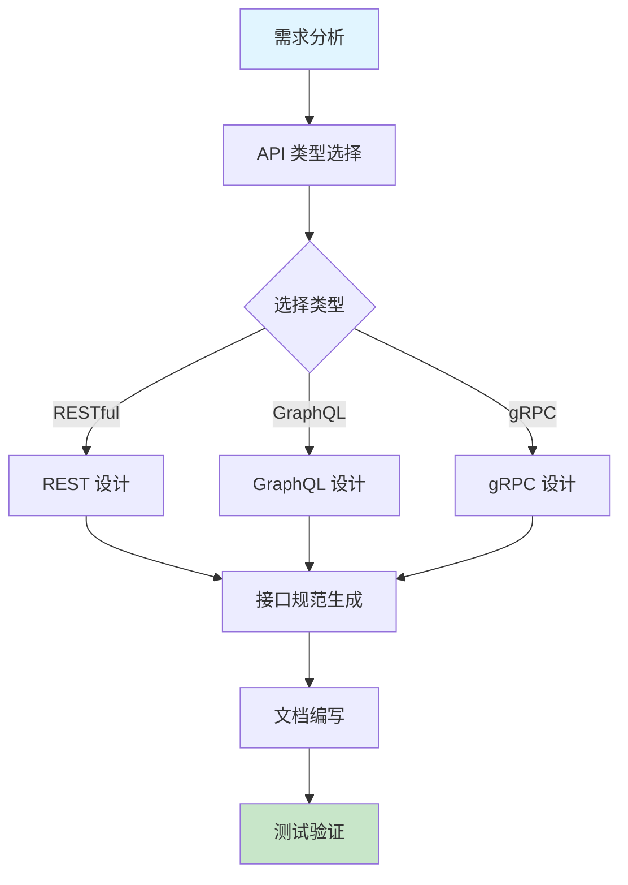

# API 设计规范

RESTful, GraphQL, gRPC 设计指南。

## 快速开始

### 5 步上手

1. **准备输入** - 明确业务需求和数据模型
2. **触发技能** - 在 AI 工具中输入 `/api-design-full`
3. **描述需求** - 提供业务场景和接口需求
4. **生成方案** - AI 生成完整的 API 设计方案
5. **迭代优化** - 根据反馈调整接口设计

### 使用示例

```
/api-design-full
请设计一个用户管理系统的 RESTful API，包括：
1. 用户注册、登录、登出
2. 个人信息管理
3. 权限控制
4. 支持 JWT 认证
```

## 工作流程



## 加载文件
- [AGENTS.md](AGENTS.md) (核心规则)
- [references/guide.md](references/guide.md) (设计指南)
- [rules/use-nouns-for-resources.md](rules/use-nouns-for-resources.md)
- [rules/implement-idempotency.md](rules/implement-idempotency.md)

## 相关 Skills
- **database-schema**, **technical-design**, **documentation**

## 示例
- 📄 [restful-api-sample.md](../../resources/examples/api-design/restful-api-sample.md)
- 📄 [api-spec-sample.yaml](../../resources/examples/api-design/api-spec-sample.yaml)

## 检查清单
- [ ] URL 名词复数 (如 `/users`)
- [ ] HTTP 方法正确 (GET/POST/PUT/DELETE)
- [ ] 标准 HTTP 状态码 (201, 204, 422)
- [ ] 响应包含统一的 request_id
- [ ] 接口版本控制 (`/v1/`)

## 最佳实践

### RESTful 设计
- ✅ **资源命名** - 使用名词复数表示资源（如 `/users` 而非 `/user`）
- ✅ **HTTP 方法** - 正确使用 GET(查询)、POST(创建)、PUT(更新)、DELETE(删除)
- ✅ **状态码** - 使用标准 HTTP 状态码，语义明确
- ✅ **版本控制** - 在 URL 中包含版本号（如 `/v1/users`）
- ✅ **过滤排序** - 支持参数化的过滤、排序和分页

### GraphQL 设计
- ✅ **Schema 设计** - 定义清晰的类型系统和关系
- ✅ **查询优化** - 避免 N+1 查询问题，使用批处理
- ✅ **权限控制** - 在 resolver 层面实现细粒度权限
- ✅ **缓存策略** - 合理使用缓存减少重复查询

### gRPC 设计
- ✅ **服务定义** - 清晰的 protobuf 服务和消息定义
- ✅ **错误处理** - 使用标准的 gRPC 状态码
- ✅ **流处理** - 合理使用单向流和双向流
- ✅ **性能优化** - 控制消息大小，使用压缩

### 通用原则
- ✅ **幂等性** - 确保重复请求产生相同结果
- ✅ **安全性** - 实现适当的认证和授权
- ✅ **可观测性** - 包含请求追踪和监控
- ✅ **文档** - 提供清晰的 API 文档

## 常见问题

**Q: 如何选择 RESTful、GraphQL 还是 gRPC?**
A: 根据具体场景选择：
- RESTful: 适合简单 CRUD 操作，浏览器友好，生态成熟
- GraphQL: 适合复杂数据查询，前端灵活获取数据，减少网络传输
- gRPC: 适合内部服务通信，性能要求高，强类型契约

**Q: 如何设计合理的 API 版本控制?**
A: 常见的版本控制方式：
1. URL 路径版本：`/v1/users` (推荐)
2. 请求头版本：`Accept: application/vnd.example.v1+json`
3. 查询参数版本：`/users?version=1` (不推荐)

**Q: 如何处理 API 错误响应?**
A: 使用统一的错误响应格式，包含：
- 错误代码 (error code)
- 错误消息 (message)
- 请求 ID (request_id)
- 时间戳 (timestamp)
- 详细信息 (details, 可选)

**Q: 如何保证 API 的安全性?**
A: 实现以下安全措施：
- 使用 HTTPS
- 实现认证机制 (JWT, OAuth2)
- 权限控制和访问限制
- 输入验证和参数校验
- 防止 CSRF 和 XSS 攻击
- 速率限制防止滥用

**Q: 如何设计 API 的扩展性?**
A: 考虑以下因素：
- 模块化设计
- 合理的资源命名和层级
- 支持字段选择和扩展
- 预留字段和灵活的响应结构
- 避免破坏性变更

## 触发指令

⚠️ **Prompt-as-Code (v5.0)**: 触发指令已迁移至 `metadata.json`。支持：
- `/api-design-full` - 完整 API 设计
- `/api-design-quick` - 快速 API 评估

## Token 效率

- 主 Skill 文件: ~300 tokens
- 参考指南总计: ~4k+ tokens


# 深度总结：AI 技能优化与维护指南

## 核心原则

为确保 AI 工具能够有效使用技能，发挥最大作用，我们制定了以下核心原则：

## 1. 文档更新与 SOP 管理

### 深度分析
文档是技能使用的基础，完整准确的文档能够显著提升 AI 工具的使用效果。定期更新文档不仅能反映最新的流程变化，还能防止未来出现错误。

### 最佳实践
- **定期审查**：每月检查一次文档，确保内容与实际流程一致
- **版本控制**：使用语义化版本号记录文档变更，维护详细的变更日志
- **SOP 标准化**：将标准操作流程 (SOP) 细化为可执行的步骤，包含前置条件、执行步骤、预期结果和异常处理
- **视觉增强**：使用 Mermaid 流程图和架构图可视化复杂流程，提升 AI 理解能力
- **多语言支持**：为核心技能提供中英双语文档，适配国际化环境

### 执行步骤
1. **识别变更点**：分析流程变更的具体内容和影响范围
2. **更新文档**：修改相关文档，确保内容准确反映新流程
3. **验证一致性**：检查所有相关文档是否同步更新
4. **测试执行**：按照更新后的 SOP 执行操作，验证流程有效性
5. **记录变更**：在变更日志中记录详细的修改内容和原因

## 2. 代码库深度分析

### 深度分析
深入而广泛地分析代码库是确保技能有效性的关键。通过系统性分析，可以发现潜在问题，优化技能实现，提升 AI 工具的使用体验。

### 分析维度
- **结构分析**：检查技能文件结构是否符合标准，验证必需文件是否存在
- **内容分析**：审核技能逻辑、工作流程、Mermaid 流程图和最佳实践
- **脚本验证**：运行验证脚本检查技能结构和规则文件
- **依赖分析**：检查外部服务集成和参数化配置
- **性能分析**：评估 Token 使用效率和响应速度

### 执行步骤
1. **结构检查**：使用 `validate-skill.py` 验证技能文件结构
2. **规则验证**：使用 `lint-rules.py` 检查规则文件的完整性
3. **功能测试**：使用 `test-skill.py` 测试技能的功能和性能
4. **问题识别**：记录发现的问题和改进机会
5. **优化实施**：根据分析结果优化技能实现

### 常见问题
- **文件缺失**：缺少必需的 SKILL.md 或 metadata.json 文件
- **结构不符合标准**：缺少建议的章节或目录
- **内容不完整**：缺少工作流程、最佳实践或常见问题
- **格式错误**：JSON 解析错误或 Markdown 格式问题
- **性能问题**：Token 使用效率低或响应速度慢

## 3. AI 工具特定操作步骤

### 深度分析
不同 AI 工具具有不同的特性和使用方式，为每个工具提供特定的操作步骤能够显著提升使用效果。通过创建工具特定的文件，可以确保用户能够根据使用的工具获取最适合的操作指南。

### 工具特性分析
- **Claude**：支持复杂的多步骤任务，擅长深度思考和推理
- **Cursor**：专注于代码编辑和生成，集成在 IDE 中使用
- **Trae**：支持多技能协同工作流，提供可视化界面
- **Antigravity**：专注于创意内容生成和设计
- **Codex**：擅长代码理解和生成，支持多种编程语言

### 工具特定文件
为每个 AI 工具创建专门的操作指南文件：
- **CLAUDE.md**：Claude 特定的操作步骤和最佳实践
- **CURSOR.md**：Cursor 特定的操作步骤和最佳实践
- **TRAE.md**：Trae 特定的操作步骤和最佳实践
- **ANTIGRAVITY.md**：Antigravity 特定的操作步骤和最佳实践
- **CODEX.md**：Codex 特定的操作步骤和最佳实践

### 执行步骤
1. **工具选择**：根据任务需求选择合适的 AI 工具
2. **文件查阅**：参考对应工具的操作指南文件
3. **环境准备**：确保工具配置正确，网络连接稳定
4. **技能激活**：使用工具特定的触发指令激活技能
5. **需求描述**：清晰描述任务需求和预期结果
6. **执行监控**：观察工具执行过程，必要时提供额外信息
7. **结果评估**：检查输出是否符合预期，进行必要的调整
8. **迭代优化**：基于反馈持续优化使用方法

### 工具特定最佳实践
- **Claude**：使用详细的指令，提供充分的上下文信息
- **Cursor**：在代码编辑器中使用，结合文件内容提供具体指令
- **Trae**：利用多技能协同工作流，定义清晰的任务序列
- **Antigravity**：提供创意方向和风格参考，鼓励多样化输出
- **Codex**：提供具体的代码示例和上下文，明确指定编程语言

## 实施建议

### 集成策略
- **统一入口**：在每个技能的 SKILL.md 文件中添加所有 AI 工具的参考链接
- **工具切换**：提供工具间切换的指南，确保用户能够根据任务需求选择最合适的工具
- **性能对比**：记录不同工具在相同任务上的表现，帮助用户做出更明智的选择

### 维护策略
- **定期更新**：每月更新一次工具特定的操作指南，反映工具的最新特性
- **用户反馈**：收集用户反馈，持续优化操作步骤
- **案例积累**：记录成功案例和最佳实践，丰富操作指南内容

### 培训策略
- **新用户引导**：为新用户提供详细的入门指南，帮助他们快速掌握技能使用方法
- **高级技巧**：为经验丰富的用户提供高级技巧和优化策略
- **场景化培训**：针对不同场景提供具体的使用示例和最佳实践

通过遵循以上原则和实施建议，我们可以确保 AI 工具能够有效使用技能，发挥最大作用，为用户提供高质量的服务。

## AI 工具参考

- [Claude 使用指南](../../../CLAUDE.md)
- [Cursor 使用指南](../../../CURSOR.md)
- [Trae 使用指南](../../../TRAE.md)
- [Antigravity 使用指南](../../../ANTIGRAVITY.md)
- [Codex 使用指南](../../../CODEX.md)
