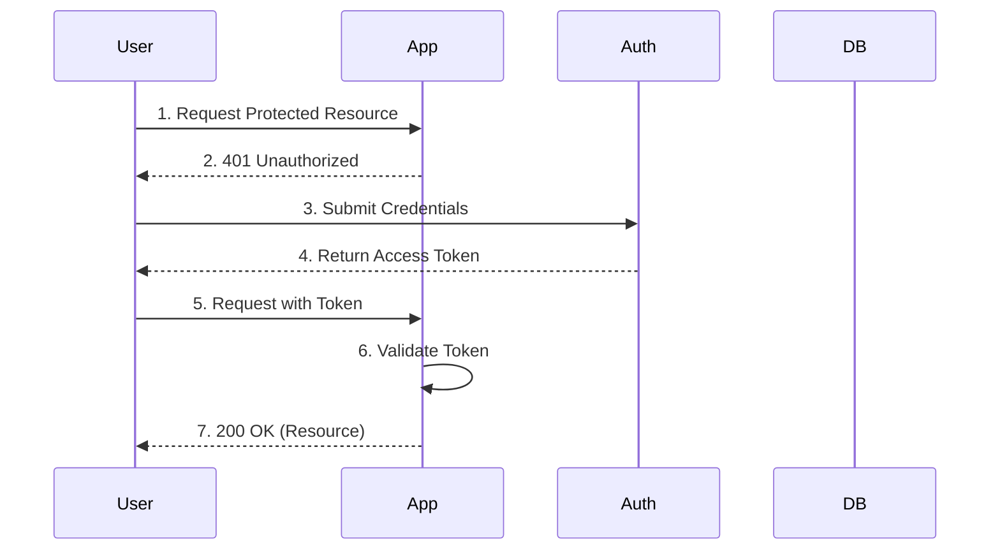

# API Design Excellence Guide

Comprehensive guide for designing modern, robust, and scalable APIs, covering RESTful, GraphQL, and gRPC.

## 1. RESTful API Principles
- **Resource-Centric**: Use nouns for resources (`/users`, not `/getUsers`).
- **HTTP Methods**: Proper use of GET, POST, PUT, PATCH, and DELETE.
- **Status Codes**: 201 Created, 204 No Content, 400 Bad Request, 422 Unprocessable Entity.
- **Idempotency**: Essential for POST/PUT operations in payment and critical systems.

## 2. GraphQL Schema Design
- **Type Safety**: Strong typing for all entities.
- **Batching**: Use Data Loaders to avoid N+1 issues.
- **Depth Limiting**: Protect against complex query attacks.

## 3. gRPC & Protobuf
- **Service Definition**: Clear service and RPC method naming.
- **Backward Compatibility**: Careful field numbering and deprecation strategies.

## 4. Security & Performance
- **Authentication**: JWT/OAuth2 best practices.
- **Rate Limiting**: Protect your infra from abuse.
- **Caching**: Use ETag and proper Cache-Control headers.

## 5. Mermaid Diagram: Auth Flow

