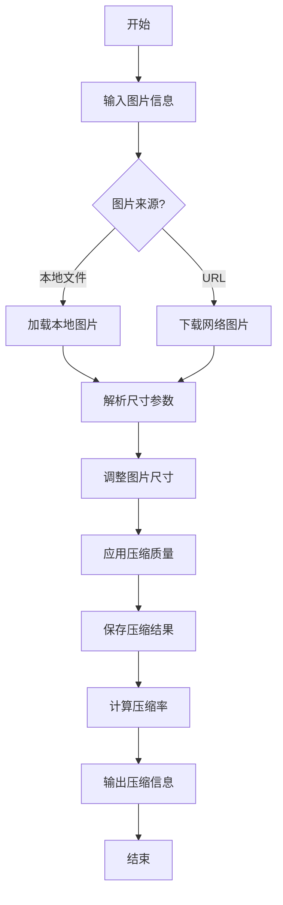

# 图片压缩使用指南

## 概述

本指南提供图片压缩工具的详细说明和最佳实践，帮助您高效地减小图像文件大小同时保持质量。

## 核心概念

### 压缩原理

图片压缩工具通过以下步骤工作：
1. **加载图片** - 从本地路径或 URL 加载图片
2. **调整尺寸** - 根据指定的目标尺寸调整图片大小
3. **压缩质量** - 调整图片的压缩质量参数
4. **保存结果** - 将压缩后的图片保存到本地
5. **计算压缩率** - 计算压缩前后的文件大小变化

### 压缩算法

- **Lossy Compression**（有损压缩）- 通过丢弃一些图像数据来减小文件大小，适用于 JPEG 格式
- **Lossless Compression**（无损压缩）- 在不损失图像质量的情况下减小文件大小，适用于 PNG 格式
- **Resizing**（调整大小）- 通过减小图像的像素尺寸来减小文件大小

## 工作流程

## 最佳实践

### 输入参数

1. **图片路径或 URL**
   - 对于本地文件，使用绝对路径或相对于当前目录的路径
   - 对于网络图片，使用完整的 URL（包含 http:// 或 https://）

2. **压缩质量**
   - **70-85** - 适用于网页和社交媒体，平衡质量和文件大小
   - **85-95** - 适用于打印和高质量展示
   - **60-70** - 适用于需要更小文件大小的场景

3. **目标尺寸**
   - **缩略图** - 200x200 或更小
   - **网页内容** - 800x600 或 1024x768
   - **社交媒体** - 根据平台要求（如 Instagram: 1080x1080）
   - **全屏显示** - 1920x1080 或更高

### 图片格式选择

| 格式 | 特点 | 最佳用途 |
|------|------|----------|
| JPEG | 有损压缩，文件小 | 照片、复杂图像 |
| PNG | 无损压缩，支持透明 | 图标、徽标、简单图形 |
| WebP | 现代格式，压缩率高 | 网页图像、移动应用 |
| GIF | 支持动画，颜色有限 | 简单动画、图标 |

### 压缩策略

1. **网页优化策略**
   - 使用 70-80 的压缩质量
   - 调整尺寸为适合网页显示的大小
   - 考虑使用 WebP 格式
   - 为不同设备提供不同尺寸的图片

2. **社交媒体策略**
   - 了解各平台的推荐尺寸
   - 使用 80-85 的压缩质量
   - 确保图片在不同设备上显示正常
   - 考虑平台的自动压缩政策

3. **存储优化策略**
   - 对于批量图片，使用脚本自动化压缩
   - 建立图片压缩的标准流程
   - 定期检查和优化现有图片
   - 考虑使用 CDN 进行图片分发

## 常见问题

### 问题 1：压缩后图片质量下降

**问题**: 压缩后的图片出现明显的质量下降，如模糊、失真或色块。

**解决方案**:
- 提高压缩质量参数（如从 70 提高到 85）
- 避免多次压缩同一张图片
- 对于 PNG 图片，考虑使用无损压缩
- 检查目标尺寸是否过小

### 问题 2：压缩效果不明显

**问题**: 压缩后的图片文件大小没有明显减小。

**解决方案**:
- 降低压缩质量参数
- 减小目标尺寸
- 检查图片格式是否适合压缩（如 PNG 格式的简单图形可能已经很小）
- 对于 JPEG 图片，尝试使用更高的压缩级别

### 问题 3：无法加载图片

**问题**: 工具无法加载指定的图片。

**解决方案**:
- 检查图片路径或 URL 是否正确
- 确保网络图片可以正常访问
- 检查图片格式是否支持
- 确保文件权限正确（对于本地文件）

### 问题 4：压缩速度慢

**问题**: 压缩大型图片时速度很慢。

**解决方案**:
- 对于非常大的图片，先手动调整尺寸
- 考虑批量处理图片，而不是单个处理
- 确保有足够的系统资源（内存和 CPU）
- 对于网络图片，考虑先下载到本地再压缩

### 问题 5：压缩后的图片在某些设备上显示异常

**问题**: 压缩后的图片在某些设备或浏览器上显示异常。

**解决方案**:
- 确保使用标准的图片格式（JPEG、PNG）
- 检查目标尺寸是否适合目标设备
- 测试在不同设备和浏览器上的显示效果
- 考虑提供多种尺寸的图片

## 参考资料

- [Image Optimization Guide](https://developers.google.com/web/fundamentals/performance/optimizing-content-efficiency/image-optimization)
- [Pillow Documentation](https://pillow.readthedocs.io/)
- [WebP Image Format](https://developers.google.com/speed/webp)
- [Responsive Images Guide](https://developer.mozilla.org/en-US/docs/Learn/HTML/Multimedia_and_embedding/Responsive_images)
