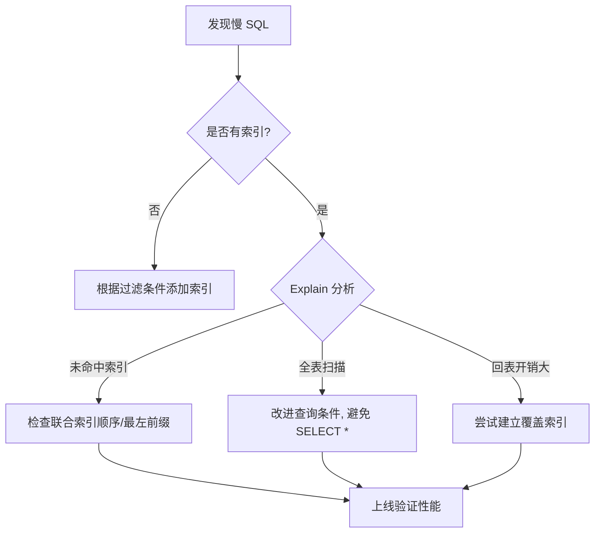

# 数据库设计指导文档

系统化的数据库设计方法,涵盖建模、范式化、索引优化和查询性能调优。

## 数据库建模

### ER 图设计

**实体关系:**

```
用户 (User)
├── id (PK)
├── username
├── email
└── created_at

订单 (Order)
├── id (PK)
├── user_id (FK → User.id)
├── total_amount
├── status
└── created_at

订单明细 (OrderItem)
├── id (PK)
├── order_id (FK → Order.id)
├── product_id (FK → Product.id)
├── quantity
└── price
```

**关系类型:**

| 关系 | 说明 | 实现方式 |
| --- | --- | --- |
| 一对一 | 用户-用户资料 | 外键 + 唯一约束 |
| 一对多 | 用户-订单 | 外键 |
| 多对多 | 商品-分类 | 中间表 |

### 范式化

**第一范式 (1NF):** 字段不可再分

❌ 不符合 1NF:
```sql
CREATE TABLE orders (
    id INT,
    products VARCHAR(255)  -- "商品A,商品B,商品C"
);
```

✅ 符合 1NF:
```sql
CREATE TABLE order_items (
    id INT,
    order_id INT,
    product_id INT
);
```

**第二范式 (2NF):** 非主键字段完全依赖主键

**第三范式 (3NF):** 非主键字段不依赖其他非主键字段

**反范式化:**

在某些场景下,为了性能可以适当反范式化:

```sql
-- 范式化: 需要 JOIN
SELECT o.*, u.username 
FROM orders o 
JOIN users u ON o.user_id = u.id;

-- 反范式化: 冗余 username,避免 JOIN
CREATE TABLE orders (
    id INT,
    user_id INT,
    username VARCHAR(50),  -- 冗余字段
    total_amount DECIMAL
);
```

## 表设计

### 命名规范

**表名:**
- 使用复数名词: `users`, `orders`
- 小写字母,下划线分隔: `order_items`
- 避免保留字: `select`, `order`

**字段名:**
- 小写字母,下划线分隔: `created_at`
- 布尔字段: `is_active`, `has_paid`
- 时间字段: `created_at`, `updated_at`

### 字段类型选择

| 数据类型 | 使用场景 | 示例 |
| --- | --- | --- |
| INT | 整数 | 用户ID、数量 |
| BIGINT | 大整数 | 订单ID、金额(分) |
| VARCHAR | 变长字符串 | 用户名、邮箱 |
| TEXT | 长文本 | 文章内容 |
| DECIMAL | 精确小数 | 金额、价格 |
| DATETIME | 日期时间 | 创建时间 |
| ENUM | 枚举 | 状态、类型 |
| JSON | JSON 数据 | 扩展属性 |

### 标准字段

每个表都应包含:

```sql
CREATE TABLE users (
    id BIGINT PRIMARY KEY AUTO_INCREMENT,
    -- 业务字段
    username VARCHAR(50) NOT NULL,
    email VARCHAR(100) NOT NULL,
    
    -- 标准字段
    created_at DATETIME NOT NULL DEFAULT CURRENT_TIMESTAMP,
    updated_at DATETIME NOT NULL DEFAULT CURRENT_TIMESTAMP ON UPDATE CURRENT_TIMESTAMP,
    deleted_at DATETIME NULL,  -- 软删除
    
    INDEX idx_email (email),
    INDEX idx_created_at (created_at)
) ENGINE=InnoDB DEFAULT CHARSET=utf8mb4;
```

## 索引优化

### 索引类型

**主键索引:**
```sql
PRIMARY KEY (id)
```

**唯一索引:**
```sql
UNIQUE INDEX idx_email (email)
```

**普通索引:**
```sql
INDEX idx_username (username)
```

**组合索引:**
```sql
INDEX idx_user_created (user_id, created_at)
```

**全文索引:**
```sql
FULLTEXT INDEX idx_content (title, content)
```

### 索引设计原则

✅ **应该创建索引:**
- WHERE 条件字段
- ORDER BY 排序字段
- JOIN 关联字段
- GROUP BY 分组字段
- 高频查询字段

❌ **不应该创建索引:**
- 低基数字段 (如性别)
- 频繁更新的字段
- 很少查询的字段
- 大字段 (TEXT, BLOB)

### 组合索引最左前缀

```sql
INDEX idx_abc (a, b, c)

-- 可以使用索引:
WHERE a = 1
WHERE a = 1 AND b = 2
WHERE a = 1 AND b = 2 AND c = 3

-- 不能使用索引:
WHERE b = 2
WHERE c = 3
WHERE b = 2 AND c = 3
```

## 查询优化

### EXPLAIN 分析

```sql
EXPLAIN SELECT * FROM users WHERE email = 'test@example.com';

+----+-------------+-------+------+---------------+-----------+
| id | select_type | table | type | possible_keys | key       |
+----+-------------+-------+------+---------------+-----------+
|  1 | SIMPLE      | users | ref  | idx_email     | idx_email |
+----+-------------+-------+------+---------------+-----------+
```

**type 类型 (性能从好到差):**
- const: 主键或唯一索引
- eq_ref: 唯一索引
- ref: 非唯一索引
- range: 范围查询
- index: 索引扫描
- ALL: 全表扫描 (最差)

### 避免全表扫描

❌ 不走索引:
```sql
-- 函数操作
SELECT * FROM users WHERE YEAR(created_at) = 2024;

-- 隐式转换
SELECT * FROM users WHERE id = '123';  -- id 是 INT

-- 前缀模糊查询
SELECT * FROM users WHERE username LIKE '%john%';
```

✅ 走索引:
```sql
-- 范围查询
SELECT * FROM users WHERE created_at >= '2024-01-01' AND created_at < '2025-01-01';

-- 类型匹配
SELECT * FROM users WHERE id = 123;

-- 后缀模糊查询
SELECT * FROM users WHERE username LIKE 'john%';
```

### 避免 SELECT *

❌ 查询所有字段:
```sql
SELECT * FROM users WHERE id = 123;
```

✅ 只查询需要的字段:
```sql
SELECT id, username, email FROM users WHERE id = 123;
```

### 分页优化

❌ 深分页性能差:
```sql
SELECT * FROM orders ORDER BY id LIMIT 100000, 20;
```

✅ 使用游标分页:
```sql
SELECT * FROM orders WHERE id > 100000 ORDER BY id LIMIT 20;
```

## 分库分表

### 垂直拆分

按业务模块拆分:

```
单库:
├── users
├── orders
├── products
└── payments

拆分后:
用户库: users
订单库: orders, order_items
商品库: products, categories
支付库: payments
```

### 水平拆分

按数据量拆分:

```
按 user_id 分片 (取模):
user_0: user_id % 4 = 0
user_1: user_id % 4 = 1
user_2: user_id % 4 = 2
user_3: user_id % 4 = 3
```

**分片键选择:**
- 查询频率高
- 数据分布均匀
- 尽量避免跨分片查询

## 最佳实践

✅ **推荐做法:**
- 合理使用索引
- 定期分析慢查询
- 监控数据库性能
- 做好容量规划
- 定期备份数据

❌ **避免:**
- 过度索引
- 忽视查询性能
- 缺少监控
- 没有备份策略


## 7. 慢查询优化决策树

