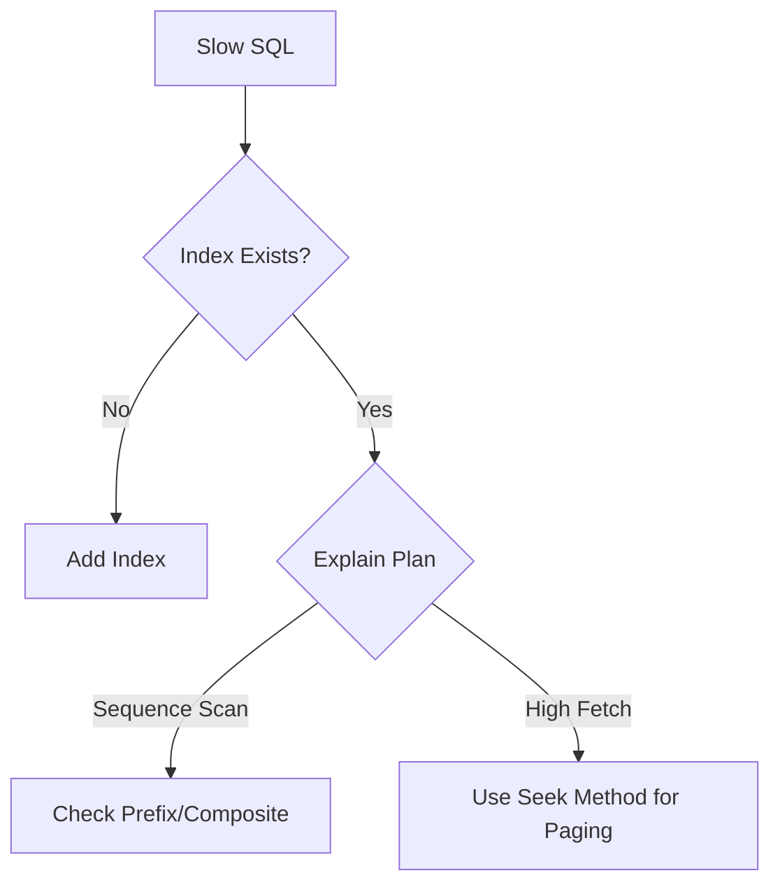

# Database Schema Design & Optimization Guide

Systematic approach for designing high-performance and scalable data models.

## 1. Data Modeling
- **Normalization**: Balancing 3NF with performance needs.
- **Entity Relationships**: Clear definition of 1:1, 1:N, and N:M relationships.

## 2. Indexing Best Practices
- **B+ Tree Fundamentals**: Understanding how indexes work.
- **Composite Indexes**: The Leftmost Prefix rule.
- **Covering Indexes**: Minimizing disk I/O.

## 3. Performance Tuning Decision Tree

## 4. Scalability
- **Partitioning**: Vertical vs. Horizontal splitting.
- **Sharding**: Choosing the right Shard Key.
