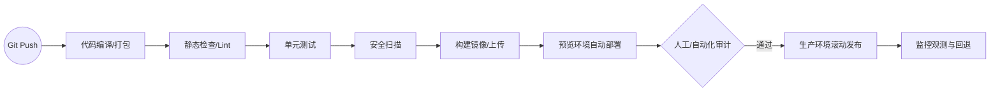

# 现代部署与 CI/CD 深度指南

从单机部署到云原生编排的完整实战路径。

## 1. 持续集成与交付 (CI/CD)

### 核心阶段
- **构建 (Build)**: 依赖安装及代码编译。
- **测试 (Test)**: 自动执行单元测试、代码风格校验。
- **打包 (Package)**: 生成 Docker 镜像或制品包。
- **部署 (Deploy)**: 自动发布到预览或生产环境。

### 工具选型
- **GitHub Actions**: 最佳集成性。
- **Jenkins**: 传统企业首选,可扩展性强。
- **GitLab CI**: 一站式 DevOps 方案。

## 2. 容器化实践 (Docker)

### 最佳实践
- **多阶段构建 (Multi-stage Builds)**: 减少最终镜像体积。
- **非 Root 运行**: 提升容器安全性。
- **层优化**: 减少变动层,利用构建缓存。

```dockerfile
# 示例：多阶段构建
FROM node:18-alpine AS builder
WORKDIR /app
COPY package*.json ./
RUN npm install
COPY . .
RUN npm run build

FROM nginx:alpine
COPY --from=builder /app/dist /usr/share/nginx/html
EXPOSE 80
```

## 3. 云原生编排 (Kubernetes)

### 核心对象
- **Deployment**: 定义应用副本、滚动更新策略。
- **Service**: 内部负载均衡与发现。
- **Ingress**: 外部流量入口及 TLS 终止。

### 部署策略
- **滚动更新 (Rolling Update)**: 逐步替换旧版本,无停机。
- **蓝绿部署 (Blue-Green)**: 全量切换,回滚极快。
- **金丝雀发布 (Canary)**: 灰度测试,逐步放大流量。

## 4. 自动化回滚机制

- **指标监控**: 部署后自动监控 5xx 报错率及响应时间。
- **自动触发**: 当指标异常时,CI 自动化脚本执行 `kubectl rollout undo`。

## 5. 基础设施即代码 (IaC)

- **Terraform**: 跨云平台资源定义。
- **Helm**: Kubernetes 包管理器,实现配置版本化。


## 7. 自动化 CI/CD 标准流水线



## 6. 部署检查清单

- [ ] 环境变量是否已在加密仓库管理 (Secret)?
- [ ] 是否包含健康检查 (Liveness/Readiness Probes)?
- [ ] 资源配额 (Resource Quotas) 是否已定义?
- [ ] 是否具备零停机切换方案?
