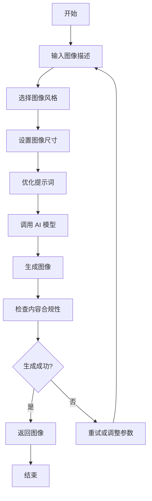

# 图像生成使用指南

## 概述

本指南提供图像生成工具的详细说明和最佳实践，帮助您高效地使用 AI 生成高质量的图像。

## 核心概念

### 生成原理

图像生成工具通过以下步骤工作：
1. **接收输入** - 接收用户提供的图像描述、风格和尺寸参数
2. **处理提示词** - 分析和优化用户的图像描述，使其更适合 AI 模型理解
3. **调用 AI 模型** - 将处理后的提示词发送给图像生成 AI 模型
4. **生成图像** - AI 模型根据提示词生成图像
5. **返回结果** - 将生成的图像返回给用户

### 支持的风格

- **realistic** - 现实主义风格，逼真的图像
- **cartoon** - 卡通风格，动画效果
- **abstract** - 抽象风格，艺术化表现
- **vintage** - 复古风格，怀旧效果
- **modern** - 现代风格，简洁时尚
- **minimal** - 极简风格，简洁干净
- **fantasy** - 奇幻风格，想象元素
- **sci-fi** - 科幻风格，未来感

## 工作流程



## 最佳实践

### 提示词编写

1. **详细具体**
   - 使用具体的形容词和细节描述
   - 说明场景、光线和氛围
   - 提及颜色、材质和纹理
   - 描述构图和视角

2. **示例提示词**

   **好的提示词**：
   ```
   一只金色毛发的拉布拉多犬在阳光明媚的草地上奔跑，舌头伸出，耳朵向后飞扬，背景是蓝天和几朵白云，温暖的午后阳光照在它身上，形成金色的光晕。
   ```

   **需要改进的提示词**：
   ```
   一只狗在跑。
   ```

3. **风格调整**
   - 根据不同的风格调整提示词
   - 例如，对于卡通风格，可以添加 "卡通风格，明亮的颜色，简洁的线条" 等描述
   - 对于复古风格，可以添加 "复古风格，胶片质感，暖色调" 等描述

### 尺寸选择

1. **512x512** - 适合快速生成和测试，文件大小小
2. **768x768** - 适合一般用途，平衡质量和生成速度
3. **1024x1024** - 适合大多数用途，高质量输出
4. **1024x1536** - 适合纵向图像，如人物肖像
5. **1536x1024** - 适合横向图像，如风景照

### 应用场景

1. **内容创作**
   - 为博客和文章创建插图
   - 为社交媒体帖子创建图像
   - 为演示文稿创建视觉元素

2. **设计辅助**
   - 生成产品概念图
   - 创建品牌视觉元素
   - 设计网站和应用界面

3. **创意探索**
   - 生成艺术作品
   - 探索不同风格的视觉效果
   - 为故事和小说创建场景图像

## 常见问题

### 问题 1：生成的图像与描述不符

**问题**: 生成的图像与用户的描述有较大差异。

**解决方案**:
- 提供更详细、具体的描述
- 明确指出关键元素的位置和特征
- 调整描述的顺序，将最重要的元素放在前面
- 尝试使用不同的风格

### 问题 2：生成速度慢

**问题**: 图像生成过程耗时较长。

**解决方案**:
- 对于测试和原型设计，使用较小的尺寸（如 512x512）
- 避免过于复杂的描述
- 考虑网络连接速度，使用稳定的网络

### 问题 3：生成的图像质量低

**问题**: 生成的图像模糊、失真或细节不足。

**解决方案**:
- 使用较大的尺寸（如 1024x1024 或更大）
- 提供更详细的描述，包括更多细节
- 尝试使用不同的风格
- 确保描述清晰明确，避免歧义

### 问题 4：某些主题无法生成

**问题**: 某些主题的图像无法生成，或生成结果不符合预期。

**解决方案**:
- 了解 AI 模型的内容政策限制
- 避免使用可能违反内容政策的描述
- 尝试使用更中性的描述方式
- 考虑使用不同的风格来表达相同的概念

### 问题 5：生成的图像包含不需要的元素

**问题**: 生成的图像中包含用户描述中未提及的元素。

**解决方案**:
- 在描述中明确排除不需要的元素
- 提供更具体的场景描述
- 尝试使用不同的风格
- 多次生成并选择最佳结果

## 参考资料

- [DALL-E 文档](https://platform.openai.com/docs/guides/images)
- [Midjourney 提示词指南](https://docs.midjourney.com/docs/prompts)
- [Stable Diffusion 文档](https://stability.ai/docs/)
- [AI 图像生成提示词工程](https://www.promptengineer.directory/)
