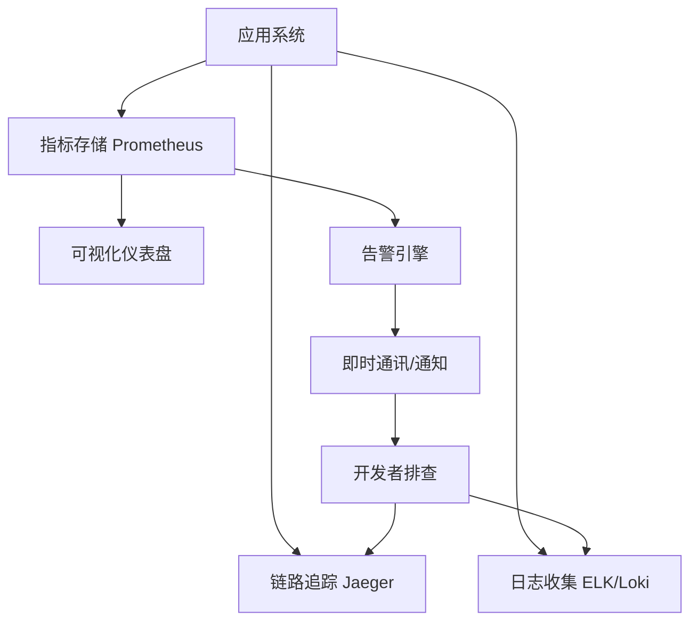

# 系统监控与可观测性深度指南

构建高可用系统的“眼睛”, 实时掌控全局状态。

## 1. 监控的四个黄金指标 (Golden Signals)

- **延迟 (Latency)**: 请求处理耗时。
- **流量 (Traffic)**: 系统吞吐量, 如 QPS / TPS。
- **错误 (Errors)**: 显式报错、隐式空结果。
- **饱和度 (Saturation)**: 资源利用率, 如 CPU 内存打满。

## 2. 三大核心支柱 (The Three Pillars)

### 指标 (Metrics)
- **工具**: Prometheus / Grafana。
- **特征**: 聚合数据、时序存储, 用于告警及趋势分析。

### 日志 (Logs)
- **工具**: ELK (Elasticsearch, Logstash, Kibana) / Loki。
- **特征**: 离散记录, 用于排查特定错误现场。

### 链路追踪 (Tracing)
- **工具**: Skywalking / Jaeger / Zipkin。
- **特征**: 记录请求在分布式系统间的全链路流转。

## 3. 告警策略设计 (Alerting)

### 原则
- **分级告警**: P0 (实时、电话/短信)、P1 (即时消息)、P2 (邮件)。
- **避免告警疲劳**: 告警必须是“可行动的” (Actionable)。
- **收敛与静默**: 相同故障在短时间内不重复告警。

## 4. 可视化看板 (Grafana)

- **核心面板**: CPU/内存趋势、API 响应 P99 / P95、活跃连接数。
- **业务面板**: 订单量、错误率、系统收益。

## 5. 常规检查清单

- [ ] 是否已配置核心核心 P0 指标的实时告警?
- [ ] 关键业务日志是否已开启脱敏并正确聚合?
- [ ] 监控系统本身是否具备备份及高可用部署?
- [ ] 告警渠道(如钉钉、Webhook)是否连通性正常?

## 7. 可观测性闭环模型

