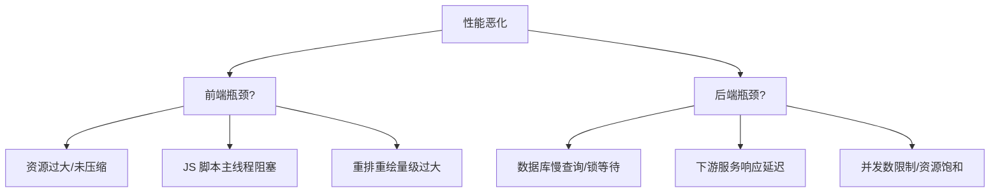

# 全栈性能调优深度指南

针对高并发、大规模 Web 应用的性能优化闭环。

## 1. 性能现状分析

### 分析工具
- **Lighthouse**: 浏览器端综合评分。
- **Chrome DevTools (Performance tab)**: 录制主线程活动。
- **Skywalking / Jaeger**: 后端链路追踪及瓶颈定位。
- **Prometheus / Grafana**: 基础设施指标实时监控。

## 2. 前端优化 (Frontend)

### 加载性能
- **资源压缩**: Gzip / Brotli。
- **图片优化**: WebP 格式、Responsive Images。
- **按需加载**: 路由级别 Code Splitting, 组件 Lazy Loading。
- **关键路径优化**: Inline critical CSS, 预加载 (Preload / Prefetch)。

### 运行时性能
- **减少重排与重绘**: 合并 DOM 操作、使用 `requestAnimationFrame`。
- **Web Workers**: 将计算密集型任务移出主线程。
- **防抖 (Debounce) 与 节流 (Throttle)**: 优化滚动、搜索等高频事件。

## 3. 后端优化 (Backend)

### 核心优化路径
- **异步化**: 将非关键路径操作投递至 MQ。
- **算法优化**: 降低时间复杂度, 减少不必要的内存分配。
- **连接池优化**: 数据库及 Redis 连接池参数精修。
- **并发控制**: 合理设置 Goroutine 或 Web Worker 数量。

## 4. 缓存策略 (Caching)

- **浏览器缓存**: `Cache-Control` 强缓存与 `ETag` 协商缓存。
- **CDN 缓存**: 将静态资源分布至边缘节点。
- **应用内缓存**: 利用本地内存缓存高频静态配置。
- **分布式缓存 (Redis)**: 反复查询的基础数据热点缓存。
- **缓存一致性**: 延迟双删、订阅 Binlog 同步策略。

## 5. 数据库优化 (Database)

- **索引优化**: 消除全表扫描, 覆盖索引设计。
- **查询优化**: 避免 `SELECT *`, 深度分页优化, 拒绝大事务。
- **物理架构**: 读写分离、主从同步延迟优化、分库分表。

## 7. 瓶颈排查思维导图

## 6. 性能调优大清单

- [ ] P99 响应时间是否符合业务要求?
- [ ] 是否识别并消除了 N+1 查询问题?
- [ ] 静态资源是否已托管至 CDN?
- [ ] 在压力测试下, 系统瓶颈位于 CPU、内存还是 I/O?
