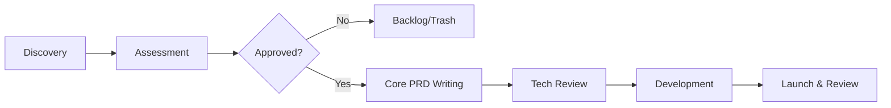

# Product Requirements Document (PRD) Excellence Guide

Professional guide for product managers to define clear, actionable, and measurable requirements.

## 1. Context & Goals
- **Problem Statement**: What pain point are we solving?
- **Success Metrics (KPIs)**: How do we measure success (e.g., +20% DAU)?
- **Scope**: What's in, out, and future.

## 2. Requirement Lifecycle Pipeline

## 3. High-Quality Acceptance Criteria (AC)
- **BDD Style**: Use Given-When-Then for clarity.
- **Edge Cases**: Always include error states and corner cases.
- **Measurability**: ACs must be binary (Pass/Fail).

## 4. Prioritization
- **MoSCoW**: Must-have, Should-have, Could-have, Won't-have.
- **P0/P1/P2**: Clear impact vs. effort mapping.
