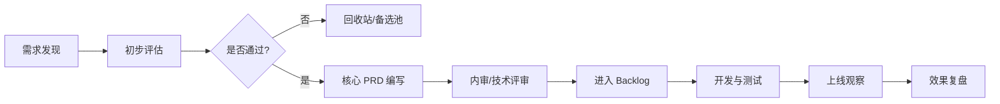

# PRD 文档模板

## 文档结构

### 1. 文档信息

```markdown
# [产品/功能名称] 产品需求文档

**文档版本:** v1.0  
**创建日期:** YYYY-MM-DD  
**最后更新:** YYYY-MM-DD  
**负责人:** [产品经理姓名]  
**评审状态:** 草稿 / 评审中 / 已批准
```

### 2. 修订历史

| 版本 | 日期 | 修订人 | 修订内容 |
| --- | --- | --- | --- |
| v1.0 | 2024-01-01 | 张三 | 初始版本 |
| v1.1 | 2024-01-15 | 张三 | 增加支付功能需求 |

### 3. 背景与目标

**问题陈述:**
- 当前存在什么问题?
- 用户遇到了什么痛点?
- 为什么现在要解决这个问题?

**产品目标:**
- 要达成什么业务目标?
- 预期的用户价值是什么?
- 成功指标是什么? (如 DAU 增长 20%)

**范围界定:**
- 本期做什么 (In Scope)
- 本期不做什么 (Out of Scope)
- 未来可能做什么 (Future Scope)

### 4. 用户分析

**目标用户:**

| 用户类型 | 特征 | 痛点 | 期望 |
| --- | --- | --- | --- |
| 新用户 | 首次使用产品 | 不知道如何开始 | 简单的引导流程 |
| 活跃用户 | 每天使用 | 操作繁琐 | 快捷操作方式 |

**用户画像示例:**

```
姓名: 李明
年龄: 28岁
职业: 互联网产品经理
使用场景: 每天需要整理和分析用户反馈
痛点: 现有工具功能分散,需要在多个平台切换
目标: 在一个平台完成所有需求管理工作
```

### 5. 功能需求

**功能列表:**

| 功能模块 | 功能点 | 优先级 | 说明 |
| --- | --- | --- | --- |
| 用户管理 | 用户注册 | P0 | 支持手机号和邮箱注册 |
| 用户管理 | 用户登录 | P0 | 支持密码和验证码登录 |
| 用户管理 | 找回密码 | P1 | 通过邮箱或手机找回 |

**详细功能描述模板:**

```markdown
#### 功能名称: 用户注册

**优先级:** P0

**功能描述:**
用户可以通过手机号或邮箱注册账号,完成注册后自动登录。

**用户流程:**
1. 用户点击"注册"按钮
2. 选择注册方式(手机号/邮箱)
3. 输入手机号/邮箱和密码
4. 接收并输入验证码
5. 同意用户协议
6. 点击"完成注册"
7. 系统创建账号并自动登录

**业务规则:**
- 密码长度 8-20 位,必须包含字母和数字
- 验证码有效期 5 分钟
- 同一手机号/邮箱每天最多发送 5 次验证码
- 注册成功后赠送新人优惠券

**异常处理:**
- 手机号/邮箱已注册 → 提示"该账号已注册,请直接登录"
- 验证码错误 → 提示"验证码错误,请重新输入"
- 验证码过期 → 提示"验证码已过期,请重新获取"

**界面要求:**
- 注册表单居中显示
- 密码输入框支持显示/隐藏切换
- 验证码输入框旁显示倒计时
- 用户协议以链接形式展示
```

### 6. 非功能需求

**性能要求:**
- 页面加载时间 < 2 秒
- API 响应时间 < 200ms
- 支持 10,000 并发用户

**安全要求:**
- 密码采用 bcrypt 加密存储
- 支持 HTTPS 传输
- 实施 CSRF 防护
- 敏感操作需要二次验证

**兼容性要求:**
- 支持 iOS 13+ / Android 8+
- 支持 Chrome、Safari、Firefox 最新两个版本
- 响应式设计,适配手机、平板、桌面

**可用性要求:**
- 系统可用性 99.9%
- 支持灰度发布
- 支持快速回滚

### 7. 验收标准

**功能验收:**

```markdown
✅ 用户可以通过手机号成功注册
✅ 用户可以通过邮箱成功注册
✅ 密码强度校验正确
✅ 验证码发送和验证正常
✅ 注册成功后自动登录
✅ 异常情况提示清晰
```

**性能验收:**
- [ ] 注册接口响应时间 < 200ms (P95)
- [ ] 页面加载时间 < 2 秒
- [ ] 1000 并发注册压测通过

**安全验收:**
- [ ] 密码加密存储验证通过
- [ ] SQL 注入测试通过
- [ ] XSS 攻击测试通过

### 8. 数据埋点

| 事件名称 | 触发时机 | 参数 | 用途 |
| --- | --- | --- | --- |
| register_start | 点击注册按钮 | register_type (phone/email) | 统计注册入口 |
| register_submit | 提交注册表单 | register_type | 统计提交次数 |
| register_success | 注册成功 | register_type, user_id | 统计注册成功率 |
| register_fail | 注册失败 | register_type, error_code | 分析失败原因 |

### 9. 依赖与风险

**技术依赖:**
- 短信服务商 API (阿里云)
- 邮件服务 (SendGrid)
- 用户协议页面需提前上线

**风险评估:**

| 风险 | 影响 | 概率 | 应对措施 |
| --- | --- | --- | --- |
| 短信服务商故障 | 无法发送验证码 | 低 | 准备备用服务商 |
| 注册量激增 | 服务器压力大 | 中 | 提前扩容,限流 |
| 恶意注册 | 资源浪费 | 中 | 增加图形验证码 |

### 10. 里程碑与排期

| 阶段 | 交付物 | 负责人 | 时间 |
| --- | --- | --- | --- |
| 需求评审 | PRD 文档 | 产品 | Week 1 |
| 技术方案 | 技术设计文档 | 研发 | Week 2 |
| 开发 | 功能代码 | 研发 | Week 3-4 |
| 测试 | 测试报告 | 测试 | Week 5 |
| 上线 | 生产环境部署 | 运维 | Week 6 |

## 模板使用建议

1. **根据项目规模调整:** 小功能可简化,大项目需更详细
2. **保持更新:** PRD 是活文档,需求变更及时更新
3. **可视化辅助:** 复杂流程用流程图,界面用原型图
4. **量化指标:** 尽量用数据而非模糊描述
5. **评审机制:** 与研发、设计、测试评审后再开发

## 常见错误

❌ **避免:**
- 需求描述过于模糊
- 缺少验收标准
- 没有优先级划分
- 忽略异常场景
- 技术实现细节过多

✅ **推荐:**
- 需求清晰、可量化
- 每个需求都有验收标准
- 明确 P0/P1/P2 优先级
- 覆盖异常和边界场景
- 聚焦"做什么",而非"怎么做"

## 11. 需求生命周期流水线



