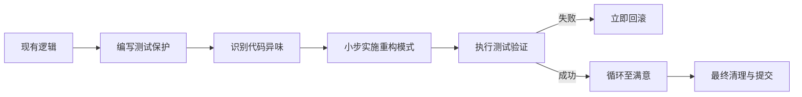

# 代码重构指导文档

系统化的代码重构方法,帮助团队改善代码质量,降低技术债务。

## 重构原则

### 何时重构

✅ **应该重构:**
- 添加新功能前
- 修复 Bug 时
- 代码审查发现问题
- 性能优化需要
- 定期技术债务清理

❌ **不应该重构:**
- 临近发布deadline
- 代码即将废弃
- 没有测试覆盖
- 不理解代码逻辑

### 重构步骤

1. **识别问题**: 找到需要重构的代码
2. **编写测试**: 确保有测试覆盖
3. **小步重构**: 每次只改一点
4. **运行测试**: 确保功能不变
5. **提交代码**: 及时提交

## 代码坏味道

### 1. 重复代码

❌ **问题代码:**

```python
def calculate_discount_for_vip(price):
    if price > 1000:
        return price * 0.8
    else:
        return price * 0.9

def calculate_discount_for_member(price):
    if price > 1000:
        return price * 0.85
    else:
        return price * 0.95
```

✅ **重构后:**

```python
def calculate_discount(price, vip_rate, normal_rate):
    if price > 1000:
        return price * vip_rate
    else:
        return price * normal_rate

# 使用
vip_price = calculate_discount(price, 0.8, 0.9)
member_price = calculate_discount(price, 0.85, 0.95)
```

### 2. 过长函数

❌ **问题代码:**

```python
def process_order(order):
    # 验证订单 (20行)
    if not order.user_id:
        raise ValueError("Missing user_id")
    # ... 更多验证
    
    # 计算价格 (30行)
    total = 0
    for item in order.items:
        total += item.price * item.quantity
    # ... 更多计算
    
    # 扣减库存 (25行)
    for item in order.items:
        product = get_product(item.product_id)
        product.stock -= item.quantity
    # ... 更多逻辑
    
    # 发送通知 (15行)
    send_email(order.user_id, "Order confirmed")
    # ... 更多通知
```

✅ **重构后:**

```python
def process_order(order):
    validate_order(order)
    total = calculate_total(order)
    deduct_stock(order)
    send_notifications(order)
    return total

def validate_order(order):
    if not order.user_id:
        raise ValueError("Missing user_id")
    # ...

def calculate_total(order):
    return sum(item.price * item.quantity for item in order.items)

def deduct_stock(order):
    for item in order.items:
        product = get_product(item.product_id)
        product.stock -= item.quantity

def send_notifications(order):
    send_email(order.user_id, "Order confirmed")
```

### 3. 过大的类

**拆分策略:**
- 按职责拆分
- 提取子类
- 提取接口

### 4. 过长参数列表

❌ **问题代码:**

```python
def create_user(username, email, password, first_name, last_name, 
                phone, address, city, country, zip_code):
    # ...
```

✅ **重构后:**

```python
@dataclass
class UserInfo:
    username: str
    email: str
    password: str
    first_name: str
    last_name: str
    phone: str
    address: str
    city: str
    country: str
    zip_code: str

def create_user(user_info: UserInfo):
    # ...
```

### 5. 发散式变化

一个类因为不同原因需要修改 → 违反单一职责原则

**解决方案:** 拆分类

#
## 7. 安全重构循环流程



## 6. 霰弹式修改

一个变化需要修改多个类 → 职责分散

**解决方案:** 移动方法,集中职责

## 重构模式

### 提取方法

```python
# Before
def print_owing():
    print_banner()
    
    # print details
    print(f"name: {name}")
    print(f"amount: {amount}")

# After
def print_owing():
    print_banner()
    print_details(name, amount)

def print_details(name, amount):
    print(f"name: {name}")
    print(f"amount: {amount}")
```

### 内联方法

```python
# Before
def get_rating():
    return more_than_five_late_deliveries() ? 2 : 1

def more_than_five_late_deliveries():
    return number_of_late_deliveries > 5

# After
def get_rating():
    return 2 if number_of_late_deliveries > 5 else 1
```

### 以多态取代条件表达式

```python
# Before
def get_speed(bird_type):
    if bird_type == "EUROPEAN":
        return get_base_speed()
    elif bird_type == "AFRICAN":
        return get_base_speed() - get_load_factor()
    elif bird_type == "NORWEGIAN":
        return 0 if is_nailed else get_base_speed()

# After
class Bird:
    def get_speed(self):
        pass

class European(Bird):
    def get_speed(self):
        return self.get_base_speed()

class African(Bird):
    def get_speed(self):
        return self.get_base_speed() - self.get_load_factor()

class Norwegian(Bird):
    def get_speed(self):
        return 0 if self.is_nailed else self.get_base_speed()
```

## 最佳实践

✅ **推荐做法:**
- 小步重构
- 保持测试通过
- 及时提交代码
- 重构和功能开发分离
- 团队达成共识

❌ **避免:**
- 大规模重构
- 没有测试就重构
- 重构时添加新功能
- 过度设计
