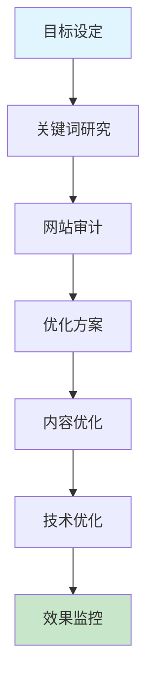

# SEO 优化

全面的 SEO 优化指南,涵盖关键词研究、页面优化和内容策略。

## 快速开始

### 5 步上手

1. **准备输入** - 明确 SEO 优化的目标和范围
2. **触发技能** - 在 AI 工具中输入触发指令
3. **描述需求** - 提供网站信息或关键词
4. **获取分析** - AI 生成详细的 SEO 分析和建议
5. **实施优化** - 根据建议进行优化并监控效果

### 使用示例

```
/seo-optimization-full
请作为 SEO 专家,对我的技术博客网站进行全面审计,识别所有优化空间并提供具体改进方案
```

## 工作流程



## 加载文件
- [references/guide.md](references/guide.md) - 主要指导文档

## 相关 Skills
| Skill | 用途 |
| --- | --- |
| **geo-optimization** | 地理位置及本地化 SEO |
| **blog-writer** | 生成符合 SEO 要求的文案 |

## 示例
- 📄 [blog-seo-audit.md](../../resources/examples/seo-optimization/blog-seo-audit.md)

## 检查清单
- [ ] 明确了当前任务的核心目标
- [ ] 遵循了行业标准的实施流程
- [ ] 产出物经过了基本的质量评审
- [ ] 关键数据或配置已进行备份或版本化
- [ ] 标题和 Meta 描述已优化
- [ ] 关键词密度合理
- [ ] 内部链接结构良好
- [ ] 网站加载速度优化
- [ ] 移动友好性已检查
- [ ] 内容质量和相关性已评估

## 功能特性

- ✅ **关键词研究** - 全面的关键词分析和推荐
- ✅ **网站审计** - 详细的 SEO 问题识别和分析
- ✅ **优化建议** - 具体可实施的改进方案
- ✅ **竞争对手分析** - 竞争格局分析和差异化策略
- ✅ **内容策略** - 基于 SEO 的内容规划和优化
- ✅ **技术 SEO** - 网站技术层面的优化建议
- ✅ **效果监控** - 优化效果的跟踪和分析

## 最佳实践

### 关键词优化
- ✅ **精准定位** - 选择与业务相关的关键词
- ✅ **竞争分析** - 评估关键词竞争程度
- ✅ **长尾关键词** - 利用长尾关键词获取精准流量
- ✅ **关键词布局** - 合理分布关键词在标题、正文和 Meta 标签
- ✅ **语义相关** - 使用语义相关的词汇增强内容相关性

### 内容优化
- ✅ **高质量内容** - 创建有价值、原创的内容
- ✅ **内容长度** - 确保内容长度足够覆盖主题
- ✅ **结构清晰** - 使用标题层级和段落分隔
- ✅ **多媒体内容** - 添加图片、视频等丰富内容
- ✅ **更新频率** - 保持内容的定期更新

### 技术优化
- ✅ **网站速度** - 优化页面加载速度
- ✅ **移动友好** - 确保网站在移动设备上正常显示
- ✅ **网站结构** - 优化网站导航和链接结构
- ✅ **爬虫友好** - 确保搜索引擎能够正确爬取网站
- ✅ **安全协议** - 使用 HTTPS 提高安全性和排名

### 链接建设
- ✅ **内部链接** - 建立合理的内部链接结构
- ✅ **外部链接** - 获取高质量的外部链接
- ✅ **链接质量** - 关注链接的相关性和权威性
- ✅ **锚文本** - 优化链接的锚文本
- ✅ **链接多样性** - 保持链接来源的多样性

### 本地 SEO
- ✅ **Google My Business** - 优化 Google 商家资料
- ✅ **本地关键词** - 针对本地搜索优化关键词
- ✅ **本地评价** - 鼓励客户留下正面评价
- ✅ **本地内容** - 创建与本地相关的内容
- ✅ **NAP 一致性** - 确保名称、地址、电话信息一致

## 常见问题

**Q: 如何选择合适的关键词?**
A: 考虑以下因素：与业务的相关性、搜索量、竞争程度、商业价值、用户意图。使用关键词研究工具如 Google Keyword Planner、Ahrefs、Semrush 等进行分析。

**Q: 如何提高网站的加载速度?**
A: 优化图片大小和格式、启用浏览器缓存、使用内容分发网络(CDN)、压缩 CSS 和 JavaScript 文件、减少重定向、选择高性能的 hosting 服务。

**Q: 如何获取高质量的外部链接?**
A: 创建有价值的内容、参与行业论坛和社区、与行业专家合作、提交到目录网站、创建信息图表和研究报告、修复损坏的链接、参与 guest blogging。

**Q: 如何优化网站的移动友好性?**
A: 使用响应式设计、确保字体大小合适、优化触摸目标大小、减少页面加载时间、避免使用 Flash、测试不同设备上的显示效果。

**Q: 如何监控 SEO 效果?**
A: 使用 Google Analytics 跟踪流量和转化率、使用 Google Search Console 监控排名和点击数据、设置关键词排名跟踪、定期进行网站审计、分析竞争对手的变化。

**Q: 内容长度对 SEO 有影响吗?**
A: 是的，内容长度是一个重要因素。对于博客文章，建议长度为 1000-2000 字，对于深度内容可以更长。关键是内容要全面覆盖主题，提供真正的价值。

**Q: 如何处理重复内容?**
A: 使用 301 重定向、使用 canonical 标签、避免内容抓取问题、创建独特的内容、使用参数处理、监控重复内容问题。

## 触发指令

⚠️ **Prompt-as-Code (v5.0)**: 触发指令已迁移至 `metadata.json`。支持：
- `/seo-optimization-full` - 完整 SEO 审计和优化
- `/seo-keyword-analysis` - 关键词竞争分析
- `/seo-content-strategy` - 基于 SEO 的内容策略
- `/seo-technical-audit` - 技术 SEO 审计

## Token 效率

- 主 Skill 文件: ~300 tokens
- 参考指南总计: ~2k+ tokens

# 深度总结：AI 技能优化与维护指南

## 核心原则

为确保 AI 工具能够有效使用技能，发挥最大作用，我们制定了以下核心原则：

## 1. 文档更新与 SOP 管理

### 深度分析
文档是技能使用的基础，完整准确的文档能够显著提升 AI 工具的使用效果。定期更新文档不仅能反映最新的流程变化，还能防止未来出现错误。

### 最佳实践
- **定期审查**：每月检查一次文档，确保内容与实际流程一致
- **版本控制**：使用语义化版本号记录文档变更，维护详细的变更日志
- **SOP 标准化**：将标准操作流程 (SOP) 细化为可执行的步骤，包含前置条件、执行步骤、预期结果和异常处理
- **视觉增强**：使用 Mermaid 流程图和架构图可视化复杂流程，提升 AI 理解能力
- **多语言支持**：为核心技能提供中英双语文档，适配国际化环境

### 执行步骤
1. **识别变更点**：分析流程变更的具体内容和影响范围
2. **更新文档**：修改相关文档，确保内容准确反映新流程
3. **验证一致性**：检查所有相关文档是否同步更新
4. **测试执行**：按照更新后的 SOP 执行操作，验证流程有效性
5. **记录变更**：在变更日志中记录详细的修改内容和原因

## 2. 代码库深度分析

### 深度分析
深入而广泛地分析代码库是确保技能有效性的关键。通过系统性分析，可以发现潜在问题，优化技能实现，提升 AI 工具的使用体验。

### 分析维度
- **结构分析**：检查技能文件结构是否符合标准，验证必需文件是否存在
- **内容分析**：审核技能逻辑、工作流程、Mermaid 流程图和最佳实践
- **脚本验证**：运行验证脚本检查技能结构和规则文件
- **依赖分析**：检查外部服务集成和参数化配置
- **性能分析**：评估 Token 使用效率和响应速度

### 执行步骤
1. **结构检查**：使用 `validate-skill.py` 验证技能文件结构
2. **规则验证**：使用 `lint-rules.py` 检查规则文件的完整性
3. **功能测试**：使用 `test-skill.py` 测试技能的功能和性能
4. **问题识别**：记录发现的问题和改进机会
5. **优化实施**：根据分析结果优化技能实现

### 常见问题
- **文件缺失**：缺少必需的 SKILL.md 或 metadata.json 文件
- **结构不符合标准**：缺少建议的章节或目录
- **内容不完整**：缺少工作流程、最佳实践或常见问题
- **格式错误**：JSON 解析错误或 Markdown 格式问题
- **性能问题**：Token 使用效率低或响应速度慢

## 3. AI 工具特定操作步骤

### 深度分析
不同 AI 工具具有不同的特性和使用方式，为每个工具提供特定的操作步骤能够显著提升使用效果。通过创建工具特定的文件，可以确保用户能够根据使用的工具获取最适合的操作指南。

### 工具特性分析
- **Claude**：支持复杂的多步骤任务，擅长深度思考和推理
- **Cursor**：专注于代码编辑和生成，集成在 IDE 中使用
- **Trae**：支持多技能协同工作流，提供可视化界面
- **Antigravity**：专注于创意内容生成和设计
- **Codex**：擅长代码理解和生成，支持多种编程语言

### 工具特定文件
为每个 AI 工具创建专门的操作指南文件：
- **CLAUDE.md**：Claude 特定的操作步骤和最佳实践
- **CURSOR.md**：Cursor 特定的操作步骤和最佳实践
- **TRAE.md**：Trae 特定的操作步骤和最佳实践
- **ANTIGRAVITY.md**：Antigravity 特定的操作步骤和最佳实践
- **CODEX.md**：Codex 特定的操作步骤和最佳实践

### 执行步骤
1. **工具选择**：根据任务需求选择合适的 AI 工具
2. **文件查阅**：参考对应工具的操作指南文件
3. **环境准备**：确保工具配置正确，网络连接稳定
4. **技能激活**：使用工具特定的触发指令激活技能
5. **需求描述**：清晰描述任务需求和预期结果
6. **执行监控**：观察工具执行过程，必要时提供额外信息
7. **结果评估**：检查输出是否符合预期，进行必要的调整
8. **迭代优化**：基于反馈持续优化使用方法

### 工具特定最佳实践
- **Claude**：使用详细的指令，提供充分的上下文信息
- **Cursor**：在代码编辑器中使用，结合文件内容提供具体指令
- **Trae**：利用多技能协同工作流，定义清晰的任务序列
- **Antigravity**：提供创意方向和风格参考，鼓励多样化输出
- **Codex**：提供具体的代码示例和上下文，明确指定编程语言

## 实施建议

### 集成策略
- **统一入口**：在每个技能的 SKILL.md 文件中添加所有 AI 工具的参考链接
- **工具切换**：提供工具间切换的指南，确保用户能够根据任务需求选择最合适的工具
- **性能对比**：记录不同工具在相同任务上的表现，帮助用户做出更明智的选择

### 维护策略
- **定期更新**：每月更新一次工具特定的操作指南，反映工具的最新特性
- **用户反馈**：收集用户反馈，持续优化操作步骤
- **案例积累**：记录成功案例和最佳实践，丰富操作指南内容

### 培训策略
- **新用户引导**：为新用户提供详细的入门指南，帮助他们快速掌握技能使用方法
- **高级技巧**：为经验丰富的用户提供高级技巧和优化策略
- **场景化培训**：针对不同场景提供具体的使用示例和最佳实践

通过遵循以上原则和实施建议，我们可以确保 AI 工具能够有效使用技能，发挥最大作用，为用户提供高质量的服务。

## AI 工具参考

- [Claude 使用指南](../../../CLAUDE.md)
- [Cursor 使用指南](../../../CURSOR.md)
- [Trae 使用指南](../../../TRAE.md)
- [Antigravity 使用指南](../../../ANTIGRAVITY.md)
- [Codex 使用指南](../../../CODEX.md)
