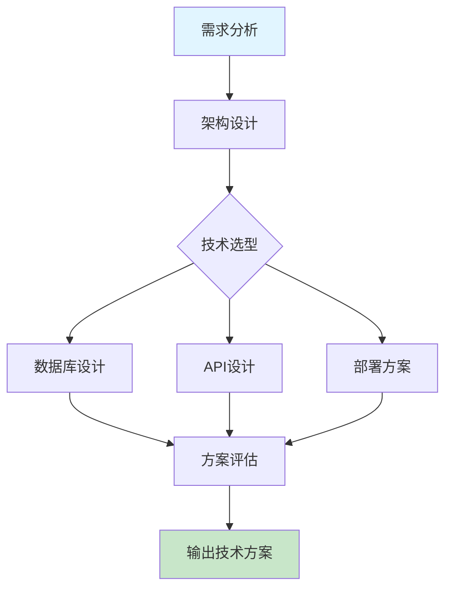

# 技术方案设计

系统架构设计、技术选型及评估框架。

## 快速开始

### 5 步上手

1. **准备输入** - 明确项目需求和业务场景
2. **触发技能** - 在 AI 工具中输入 `/technical-design-full`
3. **描述需求** - 提供业务背景、技术约束和性能要求
4. **生成方案** - AI 生成详细的技术架构方案
5. **迭代优化** - 根据反馈调整架构和技术选型

### 使用示例

```
/technical-design-full
请设计一个高并发电商系统的技术方案，要求：
1. 支持日订单 100 万+
2. 系统响应时间 < 200ms
3. 具备容灾和自动扩缩容能力
4. 技术栈：Java/Go/Python 任选其一
```

## 工作流程



## 加载文件
- [AGENTS.md](AGENTS.md) (核心规则)
- [references/guide.md](references/guide.md) (完整指南)
- [rules/zero-spof.md](rules/zero-spof.md)
- [rules/circuit-breaker.md](rules/circuit-breaker.md)

## 相关 Skills
- **database-schema**, **api-design**, **deployment-guide**

## 示例
- 📄 [architecture-sample.md](../../resources/examples/technical-design/architecture-sample.md)

## 检查清单
- [ ] 设计满足吞吐量及响应时延要求
- [ ] 无单点故障，具备容灾能力
- [ ] 具备熔断、降级或限流机制
- [ ] 关键业务逻辑配备监控指标

## 最佳实践

### 架构设计
- ✅ **分层架构** - 清晰的分层设计，职责分离
- ✅ **模块化** - 高内聚低耦合的模块划分
- ✅ **可扩展性** - 支持水平扩展和功能扩展

### 技术选型
- ✅ **技术栈一致性** - 选择适合团队技术栈的方案
- ✅ **成熟度评估** - 评估技术的稳定性和社区支持
- ✅ **性能考量** - 根据业务特点选择合适的技术

### 可靠性保障
- ✅ **冗余设计** - 关键组件的冗余配置
- ✅ **监控告警** - 完善的监控体系和告警机制
- ✅ **灾备方案** - 详细的灾难恢复计划

### 安全性
- ✅ **安全架构** - 从架构层面考虑安全设计
- ✅ **数据保护** - 敏感数据的加密和保护
- ✅ **权限控制** - 细粒度的权限管理

## 常见问题

**Q: 如何平衡架构复杂度和开发效率?**
A: 采用渐进式架构设计，初期选择简单可行的方案，随着业务发展逐步演进。避免过度设计，关注当前核心需求。

**Q: 如何评估技术选型的合理性?**
A: 从以下维度评估：性能、可靠性、可维护性、社区活跃度、团队熟悉度、成本效益。可以通过 POC 验证关键技术点。

**Q: 如何设计高可用系统?**
A: 遵循以下原则：冗余设计、无单点故障、自动故障转移、健康检查、负载均衡、数据一致性保障。

**Q: 如何处理系统的扩展性?**
A: 采用微服务架构、服务化拆分、容器化部署、自动扩缩容机制、缓存策略优化、数据库分片等技术手段。

**Q: 如何制定合理的性能目标?**
A: 基于业务场景和用户体验，参考业界标准，制定具体的性能指标，如响应时间、吞吐量、并发数等。

## 触发指令

⚠️ **Prompt-as-Code (v5.0)**: 触发指令已迁移至 `metadata.json`。支持：
- `/technical-design-full` - 完整技术方案设计
- `/technical-design-quick` - 快速架构评估

## Token 效率

- 主 Skill 文件: ~300 tokens
- 参考指南总计: ~5k+ tokens


# 深度总结：AI 技能优化与维护指南

## 核心原则

为确保 AI 工具能够有效使用技能，发挥最大作用，我们制定了以下核心原则：

## 1. 文档更新与 SOP 管理

### 深度分析
文档是技能使用的基础，完整准确的文档能够显著提升 AI 工具的使用效果。定期更新文档不仅能反映最新的流程变化，还能防止未来出现错误。

### 最佳实践
- **定期审查**：每月检查一次文档，确保内容与实际流程一致
- **版本控制**：使用语义化版本号记录文档变更，维护详细的变更日志
- **SOP 标准化**：将标准操作流程 (SOP) 细化为可执行的步骤，包含前置条件、执行步骤、预期结果和异常处理
- **视觉增强**：使用 Mermaid 流程图和架构图可视化复杂流程，提升 AI 理解能力
- **多语言支持**：为核心技能提供中英双语文档，适配国际化环境

### 执行步骤
1. **识别变更点**：分析流程变更的具体内容和影响范围
2. **更新文档**：修改相关文档，确保内容准确反映新流程
3. **验证一致性**：检查所有相关文档是否同步更新
4. **测试执行**：按照更新后的 SOP 执行操作，验证流程有效性
5. **记录变更**：在变更日志中记录详细的修改内容和原因

## 2. 代码库深度分析

### 深度分析
深入而广泛地分析代码库是确保技能有效性的关键。通过系统性分析，可以发现潜在问题，优化技能实现，提升 AI 工具的使用体验。

### 分析维度
- **结构分析**：检查技能文件结构是否符合标准，验证必需文件是否存在
- **内容分析**：审核技能逻辑、工作流程、Mermaid 流程图和最佳实践
- **脚本验证**：运行验证脚本检查技能结构和规则文件
- **依赖分析**：检查外部服务集成和参数化配置
- **性能分析**：评估 Token 使用效率和响应速度

### 执行步骤
1. **结构检查**：使用 `validate-skill.py` 验证技能文件结构
2. **规则验证**：使用 `lint-rules.py` 检查规则文件的完整性
3. **功能测试**：使用 `test-skill.py` 测试技能的功能和性能
4. **问题识别**：记录发现的问题和改进机会
5. **优化实施**：根据分析结果优化技能实现

### 常见问题
- **文件缺失**：缺少必需的 SKILL.md 或 metadata.json 文件
- **结构不符合标准**：缺少建议的章节或目录
- **内容不完整**：缺少工作流程、最佳实践或常见问题
- **格式错误**：JSON 解析错误或 Markdown 格式问题
- **性能问题**：Token 使用效率低或响应速度慢

## 3. AI 工具特定操作步骤

### 深度分析
不同 AI 工具具有不同的特性和使用方式，为每个工具提供特定的操作步骤能够显著提升使用效果。通过创建工具特定的文件，可以确保用户能够根据使用的工具获取最适合的操作指南。

### 工具特性分析
- **Claude**：支持复杂的多步骤任务，擅长深度思考和推理
- **Cursor**：专注于代码编辑和生成，集成在 IDE 中使用
- **Trae**：支持多技能协同工作流，提供可视化界面
- **Antigravity**：专注于创意内容生成和设计
- **Codex**：擅长代码理解和生成，支持多种编程语言

### 工具特定文件
为每个 AI 工具创建专门的操作指南文件：
- **CLAUDE.md**：Claude 特定的操作步骤和最佳实践
- **CURSOR.md**：Cursor 特定的操作步骤和最佳实践
- **TRAE.md**：Trae 特定的操作步骤和最佳实践
- **ANTIGRAVITY.md**：Antigravity 特定的操作步骤和最佳实践
- **CODEX.md**：Codex 特定的操作步骤和最佳实践

### 执行步骤
1. **工具选择**：根据任务需求选择合适的 AI 工具
2. **文件查阅**：参考对应工具的操作指南文件
3. **环境准备**：确保工具配置正确，网络连接稳定
4. **技能激活**：使用工具特定的触发指令激活技能
5. **需求描述**：清晰描述任务需求和预期结果
6. **执行监控**：观察工具执行过程，必要时提供额外信息
7. **结果评估**：检查输出是否符合预期，进行必要的调整
8. **迭代优化**：基于反馈持续优化使用方法

### 工具特定最佳实践
- **Claude**：使用详细的指令，提供充分的上下文信息
- **Cursor**：在代码编辑器中使用，结合文件内容提供具体指令
- **Trae**：利用多技能协同工作流，定义清晰的任务序列
- **Antigravity**：提供创意方向和风格参考，鼓励多样化输出
- **Codex**：提供具体的代码示例和上下文，明确指定编程语言

## 实施建议

### 集成策略
- **统一入口**：在每个技能的 SKILL.md 文件中添加所有 AI 工具的参考链接
- **工具切换**：提供工具间切换的指南，确保用户能够根据任务需求选择最合适的工具
- **性能对比**：记录不同工具在相同任务上的表现，帮助用户做出更明智的选择

### 维护策略
- **定期更新**：每月更新一次工具特定的操作指南，反映工具的最新特性
- **用户反馈**：收集用户反馈，持续优化操作步骤
- **案例积累**：记录成功案例和最佳实践，丰富操作指南内容

### 培训策略
- **新用户引导**：为新用户提供详细的入门指南，帮助他们快速掌握技能使用方法
- **高级技巧**：为经验丰富的用户提供高级技巧和优化策略
- **场景化培训**：针对不同场景提供具体的使用示例和最佳实践

通过遵循以上原则和实施建议，我们可以确保 AI 工具能够有效使用技能，发挥最大作用，为用户提供高质量的服务。

## AI 工具参考

- [Claude 使用指南](../../../CLAUDE.md)
- [Cursor 使用指南](../../../CURSOR.md)
- [Trae 使用指南](../../../TRAE.md)
- [Antigravity 使用指南](../../../ANTIGRAVITY.md)
- [Codex 使用指南](../../../CODEX.md)
