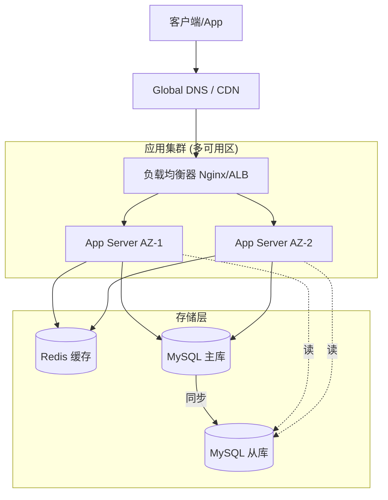

# 技术方案设计指导文档

系统化的技术方案设计方法,帮助架构师和技术负责人设计可靠的系统架构。

## 技术方案文档结构

### 1. 背景与目标

**包含内容:**
- 业务背景
- 技术现状
- 存在问题
- 设计目标
- 成功指标

**示例:**

```markdown
## 背景

当前电商平台日订单量达到 10万+,现有单体架构面临以下问题:
- 数据库连接数达到瓶颈
- 部署耗时长,影响业务
- 代码耦合严重,维护困难

## 目标

- 支持 100万+ 日订单量
- 部署时间从 30分钟降至 5分钟
- 核心服务可独立扩展
- 系统可用性达到 99.95%
```

### 2. 架构设计

**分层架构:**

```
┌─────────────────────────────────┐
│      前端层 (Web/Mobile)         │
└─────────────────────────────────┘
           ↓
┌─────────────────────────────────┐
│      API 网关层                  │
│  (认证、限流、路由)               │
└─────────────────────────────────┘
           ↓
┌──────────┬──────────┬──────────┐
│ 用户服务  │ 订单服务  │ 商品服务  │
│ (微服务)  │ (微服务)  │ (微服务)  │
└──────────┴──────────┴──────────┘
           ↓
┌─────────────────────────────────┐
│      数据层 (MySQL/Redis/MQ)     │
└─────────────────────────────────┘
```

**核心组件:**

| 组件 | 技术选型 | 职责 |
| --- | --- | --- |
| API 网关 | Kong/APISIX | 统一入口、认证、限流 |
| 服务注册 | Consul/Nacos | 服务发现、配置管理 |
| 负载均衡 | Nginx/Envoy | 流量分发 |
| 消息队列 | Kafka/RabbitMQ | 异步解耦 |
| 缓存 | Redis | 热点数据缓存 |
| 数据库 | MySQL | 持久化存储 |
| 监控 | Prometheus+Grafana | 系统监控 |

### 3. 技术选型

**选型对比:**

| 方案 | 优点 | 缺点 | 适用场景 |
| --- | --- | --- | --- |
| 单体架构 | 简单、易部署 | 扩展性差 | 小型项目 |
| 微服务 | 可独立扩展 | 复杂度高 | 大型项目 |
| Serverless | 按需付费 | 冷启动慢 | 突发流量 |

**选型依据:**
- 业务规模和增长预期
- 团队技术栈
- 成本预算
- 时间要求

### 4. 数据库设计

**分库分表策略:**

```
用户库 (按 user_id 分片)
├── user_0 (user_id % 4 = 0)
├── user_1 (user_id % 4 = 1)
├── user_2 (user_id % 4 = 2)
└── user_3 (user_id % 4 = 3)

订单库 (按 order_id 分片)
├── order_0
├── order_1
├── order_2
└── order_3
```

**读写分离:**

```
写操作 → 主库
读操作 → 从库1、从库2、从库3 (负载均衡)
```

### 5. 性能优化

**缓存策略:**

```python
# 多级缓存
def get_product(product_id):
    # L1: 本地缓存
    data = local_cache.get(product_id)
    if data:
        return data
    
    # L2: Redis 缓存
    data = redis.get(f"product:{product_id}")
    if data:
        local_cache.set(product_id, data)
        return data
    
    # L3: 数据库
    data = db.query(product_id)
    redis.set(f"product:{product_id}", data, ttl=3600)
    local_cache.set(product_id, data)
    return data
```

**异步处理:**

```
同步流程:
用户下单 → 创建订单 → 扣减库存 → 发送通知 → 返回结果
(总耗时: 500ms)

异步优化:
用户下单 → 创建订单 → 返回结果 (100ms)
         ↓
    消息队列 → 扣减库存 (异步)
         ↓
    消息队列 → 发送通知 (异步)
```

#
## 7. 经典高可用架构模型



## 6. 安全设计

**认证授权:**

```
JWT Token 认证:
1. 用户登录 → 颁发 Access Token (15分钟) + Refresh Token (7天)
2. 请求 API → 携带 Access Token
3. Token 过期 → 使用 Refresh Token 刷新
4. Refresh Token 过期 → 重新登录
```

**数据加密:**
- 传输加密: HTTPS/TLS
- 存储加密: AES-256
- 密码加密: bcrypt + salt

### 7. 容灾设计

**高可用:**

```
多机房部署:
┌─────────┐     ┌─────────┐     ┌─────────┐
│ 机房 A   │     │ 机房 B   │     │ 机房 C   │
│ (主)     │ ←→  │ (备)     │ ←→  │ (备)     │
└─────────┘     └─────────┘     └─────────┘
```

**降级策略:**
- 核心功能优先保证
- 非核心功能降级或关闭
- 返回缓存数据
- 限流保护

### 8. 监控告警

**监控指标:**

| 类型 | 指标 | 阈值 |
| --- | --- | --- |
| 可用性 | 服务可用率 | > 99.95% |
| 性能 | API 响应时间 | P95 < 200ms |
| 容量 | CPU 使用率 | < 70% |
| 容量 | 内存使用率 | < 80% |
| 业务 | 订单成功率 | > 99% |

**告警规则:**
- P0: 服务不可用 → 立即电话通知
- P1: 性能下降 → 5分钟内短信通知
- P2: 资源告警 → 邮件通知

## 最佳实践

✅ **推荐做法:**
- 从业务需求出发
- 考虑未来扩展性
- 技术选型要务实
- 充分评估风险
- 与团队充分讨论

❌ **避免:**
- 过度设计
- 盲目追新
- 忽视运维成本
- 缺少性能评估
