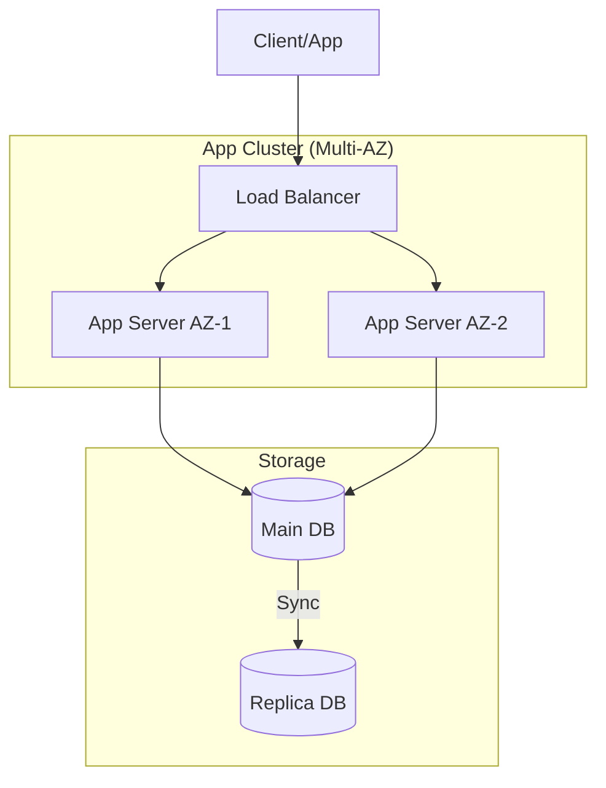

# Technical Design Documentation (TDD) Guide

Structured approach for designing reliable and scalable system architectures.

## 1. Architecture Patterns
- **Layered Architecture**: Decoupling UI, Business, and Data layers.
- **Microservices**: Independent deployment and scaling.
- **Event-Driven**: Asynchronous communication via MQ (Kafka/RabbitMQ).

## 2. Component Selection
- **Database**: Relational vs. NoSQL (PostgreSQL vs. MongoDB).
- **Caching**: Redis for hot data and session management.
- **Messaging**: Kafka for high-throughput, RabbitMQ for complex routing.

## 3. High Availability & Resilience
- **Circuit Breaker**: Preventing cascading failures (e.g., Hystrix/Resilience4j).
- **Rate Limiting**: Protecting ingress traffic.
- **Disaster Recovery**: Multi-AZ and Cross-Region replication.

## 4. Mermaid Diagram: HA Model

