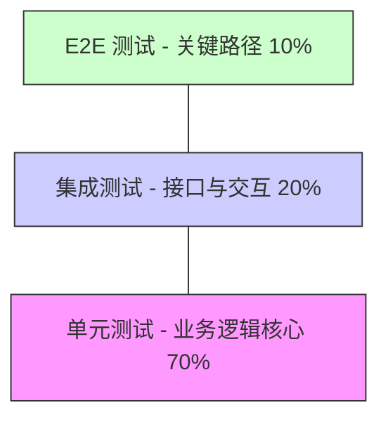

# 测试策略指导文档

全面的测试策略,涵盖单元测试、集成测试、E2E测试和测试覆盖率。

## 测试金字塔

```
       /\
      /  \  E2E 测试 (少量)
     /    \
    /------\  集成测试 (适量)
   /        \
  /----------\  单元测试 (大量)
 /____________\
```

**比例建议:**
- 单元测试: 70%
- 集成测试: 20%
- E2E 测试: 10%

## 单元测试

### 测试原则

**FIRST 原则:**
- **Fast**: 快速执行
- **Independent**: 独立运行
- **Repeatable**: 可重复
- **Self-Validating**: 自我验证
- **Timely**: 及时编写

### 测试结构

**AAA 模式:**

```python
def test_calculate_discount():
    # Arrange (准备)
    price = 1000
    discount_rate = 0.1
    
    # Act (执行)
    result = calculate_discount(price, discount_rate)
    
    # Assert (断言)
    assert result == 900
```

### 测试覆盖

**应该测试:**
- ✅ 正常情况
- ✅ 边界情况
- ✅ 异常情况
- ✅ 业务逻辑

**示例:**

```python
def test_divide():
    # 正常情况
    assert divide(10, 2) == 5
    
    # 边界情况
    assert divide(0, 5) == 0
    assert divide(1, 3) == 0.333...
    
    # 异常情况
    with pytest.raises(ZeroDivisionError):
        divide(10, 0)
```

### Mock 和 Stub

```python
def test_send_email():
    # Mock 外部依赖
    email_service = Mock()
    
    # 执行
    send_welcome_email(user, email_service)
    
    # 验证调用
    email_service.send.assert_called_once_with(
        to=user.email,
        subject="Welcome",
        body="..."
    )
```

## 集成测试

### 测试范围

测试多个模块协作:
- 数据库交互
- API 调用
- 消息队列
- 缓存

### 示例

```python
def test_create_order_integration():
    # 准备测试数据
    user = create_test_user()
    product = create_test_product()
    
    # 创建订单
    order = create_order(user.id, [
        {"product_id": product.id, "quantity": 2}
    ])
    
    # 验证订单
    assert order.user_id == user.id
    assert len(order.items) == 1
    
    # 验证库存扣减
    product.refresh_from_db()
    assert product.stock == original_stock - 2
    
    # 清理测试数据
    cleanup_test_data()
```

## E2E 测试

### 测试场景

测试完整用户流程:

```python
def test_user_purchase_flow():
    # 1. 用户注册
    register_page.fill_form({
        "username": "testuser",
        "email": "test@example.com",
        "password": "Test123!"
    })
    register_page.submit()
    
    # 2. 浏览商品
    home_page.search("iPhone")
    product_list = home_page.get_products()
    assert len(product_list) > 0
    
    # 3. 加入购物车
    product_page.add_to_cart()
    assert cart.item_count == 1
    
    # 4. 结算
    checkout_page.fill_address(test_address)
    checkout_page.select_payment("credit_card")
    checkout_page.submit()
    
    # 5. 验证订单
    assert order_page.get_status() == "pending"
```

## 测试覆盖率

### 目标

| 类型 | 目标覆盖率 |
| --- | --- |
| 核心业务逻辑 | 90%+ |
| 工具函数 | 80%+ |
| UI 组件 | 60%+ |
| 配置代码 | 可选 |

### 覆盖率报告

```bash
# 生成覆盖率报告
pytest --cov=src --cov-report=html

# 查看报告
open htmlcov/index.html
```

## 最佳实践

✅ **推荐做法:**
- TDD 开发
- 持续集成
- 自动化测试
- 定期review测试
- 维护测试文档

❌ **避免:**
- 忽视测试
- 测试覆盖率造假
- 测试依赖顺序
- 测试过于复杂


## 7. 理想化测试金字塔模型

