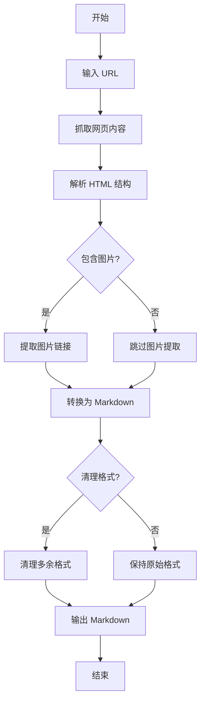

# URL 转 Markdown 使用指南

## 概述

本指南提供 URL 转 Markdown 工具的详细说明和最佳实践，帮助您高效地将网页内容转换为结构化的 Markdown 格式。

## 核心概念

### 转换原理

URL 转 Markdown 工具通过以下步骤工作：
1. **抓取网页** - 使用 HTTP 请求获取网页内容
2. **解析 HTML** - 解析网页的 HTML 结构
3. **提取内容** - 提取标题、段落、列表、图片等元素
4. **转换格式** - 将 HTML 元素转换为对应的 Markdown 格式
5. **清理优化** - 清理多余的格式和空白，优化输出结果

### 支持的元素

- **标题** (h1-h6) - 转换为 Markdown 标题格式
- **段落** (p) - 转换为普通文本段落
- **列表** (ul, ol) - 转换为 Markdown 列表格式
- **图片** (img) - 转换为 Markdown 图片格式
- **链接** (a) - 转换为 Markdown 链接格式
- **粗体/斜体** (strong, em) - 转换为 Markdown 粗体/斜体格式

## 工作流程

## 最佳实践

### 输入 URL

1. **使用完整 URL** - 确保 URL 包含协议（http:// 或 https://）
2. **检查可访问性** - 确保网页可以正常访问，没有访问限制
3. **选择合适的网页** - 对于长网页，考虑只转换其中的部分内容

### 转换选项

1. **包含图片** - 对于包含重要图片的网页，启用此选项
2. **清理格式** - 对于复杂网页，启用此选项以获得更干净的输出
3. **分段转换** - 对于非常长的网页，考虑分段转换以获得更好的结果

### 输出优化

1. **检查格式** - 转换后检查 Markdown 格式是否正确
2. **调整标题层级** - 根据需要调整标题的层级结构
3. **优化图片链接** - 确保图片链接可以正常访问
4. **清理多余内容** - 移除不需要的导航栏、广告等内容

## 常见问题

### 问题 1：转换失败

**问题**: 输入 URL 后转换失败，显示错误信息。

**解决方案**:
- 检查 URL 是否正确且可访问
- 确保网络连接正常
- 尝试使用不同的转换选项
- 对于需要登录的网页，先登录后再尝试转换

### 问题 2：格式不正确

**问题**: 转换后的 Markdown 格式不正确，包含多余的标签或格式。

**解决方案**:
- 启用"清理格式"选项
- 手动编辑转换后的 Markdown 内容
- 对于复杂网页，考虑只转换其中的部分内容

### 问题 3：图片不显示

**问题**: 转换后的 Markdown 中的图片不显示。

**解决方案**:
- 确保网页中的图片可以正常访问
- 检查图片链接是否正确
- 对于需要登录才能访问的图片，考虑先下载图片再手动添加

### 问题 4：转换速度慢

**问题**: 对于大型网页，转换速度较慢。

**解决方案**:
- 对于大型网页，考虑分段转换
- 禁用"包含图片"选项以提高速度
- 选择网络连接良好的环境进行转换

## 参考资料

- [Markdown 官方文档](https://daringfireball.net/projects/markdown/)
- [CommonMark 规范](https://commonmark.org/)
- [Beautiful Soup 文档](https://www.crummy.com/software/BeautifulSoup/bs4/doc/)
- [Requests 库文档](https://docs.python-requests.org/en/latest/)
