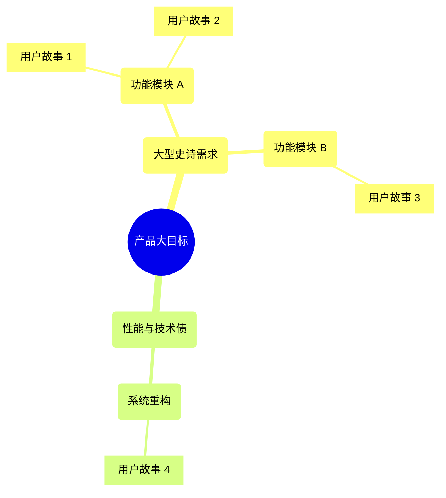

# 用户故事编写指导文档

敏捷开发中用户故事的编写方法和最佳实践。

## 用户故事格式

### 标准格式

```
作为 [角色]
我想要 [功能]
以便于 [价值]
```

**示例:**

```
作为 电商平台用户
我想要 能够保存商品到购物车
以便于 稍后购买,不用重复搜索
```

### 3C 原则

| 要素 | 说明 | 示例 |
| --- | --- | --- |
| **Card (卡片)** | 简短描述 | 用户故事卡片 |
| **Conversation (对话)** | 讨论细节 | 与团队沟通需求 |
| **Confirmation (确认)** | 验收标准 | 如何验证完成 |

## INVEST 原则

好的用户故事应该符合 INVEST 原则:

| 原则 | 说明 | 示例 |
| --- | --- | --- |
| **Independent (独立)** | 可以独立开发和交付 | 不依赖其他故事 |
| **Negotiable (可协商)** | 细节可以讨论 | 实现方式灵活 |
| **Valuable (有价值)** | 为用户带来价值 | 解决实际问题 |
| **Estimable (可估算)** | 可以估算工作量 | 不会太模糊 |
| **Small (小)** | 一个迭代内完成 | 1-3天完成 |
| **Testable (可测试)** | 有明确验收标准 | 可以验证 |

## 验收标准

### Given-When-Then 格式

```
Given (前置条件)
When (触发动作)
Then (预期结果)
```

**示例:**

```
用户故事: 用户登录

验收标准:

场景1: 成功登录
Given 用户已注册
And 用户在登录页面
When 用户输入正确的用户名和密码
And 点击"登录"按钮
Then 系统验证用户信息
And 用户跳转到首页
And 显示欢迎消息

场景2: 登录失败
Given 用户在登录页面
When 用户输入错误的密码
And 点击"登录"按钮
Then 系统显示"用户名或密码错误"
And 用户停留在登录页面
And 登录失败次数+1
```

### Checklist 格式

```
用户故事: 购物车功能

验收标准:
- [ ] 用户可以添加商品到购物车
- [ ] 用户可以修改商品数量
- [ ] 用户可以删除购物车商品
- [ ] 购物车显示商品总价
- [ ] 购物车数据持久化保存
- [ ] 购物车商品数量显示在图标上
```

## 优先级划分

### MoSCoW 方法

| 优先级 | 含义 | 处理方式 |
| --- | --- | --- |
| **Must have** | 必须有 | 本迭代必须完成 |
| **Should have** | 应该有 | 重要但可延后 |
| **Could have** | 可以有 | 有时间就做 |
| **Won't have** | 不会有 | 本迭代不做 |

### 价值 vs 工作量矩阵

```
高价值 | 优先做 | 计划做
      |--------|--------
低价值 | 考虑做 | 不做
      低工作量  高工作量
```

## 故事拆分

### 拆分方法

**按工作流拆分:**
```
大故事: 用户注册

拆分为:
- 故事1: 用户输入基本信息注册
- 故事2: 用户邮箱验证
- 故事3: 用户完善个人资料
```

**按业务规则拆分:**
```
大故事: 商品搜索

拆分为:
- 故事1: 按商品名称搜索
- 故事2: 按分类筛选
- 故事3: 按价格区间筛选
- 故事4: 搜索结果排序
```

**按数据拆分:**
```
大故事: 支持多种支付方式

拆分为:
- 故事1: 支持支付宝支付
- 故事2: 支持微信支付
- 故事3: 支持银行卡支付
```

## Story Mapping

### 用户旅程地图

```
用户旅程: 在线购物

浏览商品 → 加入购物车 → 结算 → 支付 → 收货

每个阶段的用户故事:

浏览商品:
- 搜索商品
- 查看商品详情
- 查看商品评价

加入购物车:
- 添加商品
- 修改数量
- 删除商品

结算:
- 选择收货地址
- 选择配送方式
- 使用优惠券

支付:
- 选择支付方式
- 完成支付
- 查看订单

收货:
- 查看物流
- 确认收货
- 评价商品
```

## 用户故事模板

### 功能型故事

```
标题: 用户登录

作为 注册用户
我想要 使用用户名和密码登录
以便于 访问我的个人账户和数据

验收标准:
- [ ] 用户可以输入用户名和密码
- [ ] 系统验证用户信息
- [ ] 登录成功后跳转到首页
- [ ] 登录失败显示错误提示
- [ ] 记住登录状态7天

优先级: Must have
估算: 3 Story Points
```

### 技术型故事

```
标题: 数据库性能优化

作为 开发团队
我们需要 优化数据库查询性能
以便于 提升系统响应速度

验收标准:
- [ ] 慢查询响应时间 < 100ms
- [ ] 添加必要的索引
- [ ] 优化 N+1 查询
- [ ] 查询性能提升 50%

优先级: Should have
估算: 5 Story Points
```

### Bug 修复故事

```
标题: 修复购物车数量更新问题

作为 用户
我发现 修改购物车商品数量后,总价没有更新
我期望 总价能实时更新

重现步骤:
1. 添加商品到购物车
2. 修改商品数量
3. 观察总价

预期: 总价实时更新
实际: 总价不变

优先级: Must have
估算: 2 Story Points
```

## Sprint 规划

### Backlog 管理

**优先级排序:**
1. 必须有的功能 (Must have)
2. 高价值低成本
3. 用户反馈强烈
4. 技术依赖关系

**Sprint 容量:**
```
团队速度: 30 Story Points/Sprint
Sprint 长度: 2 周

本 Sprint 计划:
- 用户登录 (3 points)
- 商品搜索 (5 points)
- 购物车 (8 points)
- 订单创建 (8 points)
- 性能优化 (5 points)
总计: 29 points
```

## 最佳实践

✅ **推荐做法:**
- 从用户角度描述
- 聚焦业务价值
- 保持故事独立
- 及时更新状态
- 与团队充分沟通

❌ **避免:**
- 技术实现细节过多
- 故事过大无法估算
- 缺少验收标准
- 优先级不明确
- 依赖关系复杂


## 7. 故事分层与映射关系

