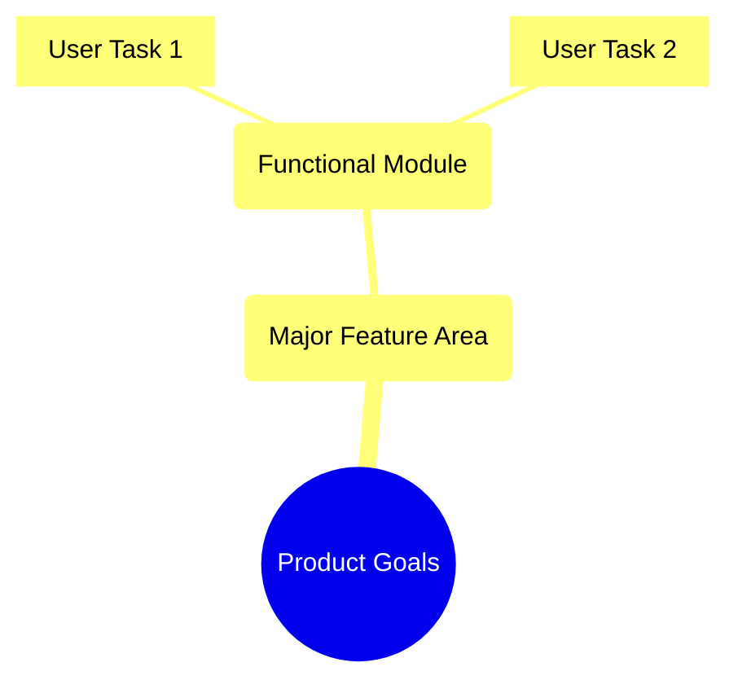

# Agile User Story & Backlog Management Guide

Best practices for writing stories that deliver real value to users.

## 1. INVEST Principle
- **Independent**: Decoupled from other stories.
- **Negotiable**: Flexible for discussion.
- **Valuable**: Clear benefit to users/business.
- **Estimable**: Team can gauge effort.
- **Small**: Fit within a single Sprint.
- **Testable**: Clear ACs.

## 2. Story Hierarchy & Mapping

## 3. Writing Format
- **Template**: "As a [role], I want to [action], so that [value]."
- **3Cs**: Card, Conversation, Confirmation.
