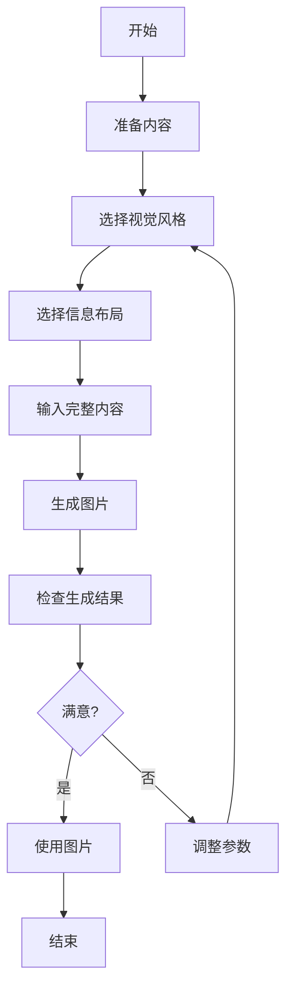

# 小红书图片生成使用指南

## 概述

本指南提供小红书图片生成工具的详细说明和最佳实践，帮助您高效地创建符合小红书平台风格的图片内容。

## 核心概念

### 风格系统

小红书图片生成工具支持 9 种视觉风格，每种风格都有其独特的特点和适用场景：

| 风格 | 特点 | 适用场景 |
|------|------|----------|
| **cute** | 可爱、少女感、粉色调 | 美妆、时尚、生活方式 |
| **fresh** | 清新、自然、绿色调 | 健康、美食、旅行 |
| **warm** | 温馨、暖色调、舒适 | 家庭、情感、生活感悟 |
| **bold** | 大胆、鲜明、对比强烈 | 时尚、艺术、创意 |
| **minimal** | 简洁、干净、留白 | 科技、极简主义、专业内容 |
| **retro** | 复古、怀旧、胶片感 | 复古风格、怀旧内容 |
| **pop** | 流行、时尚、明亮 | 潮流、时尚、年轻文化 |
| **notion** | 简约、现代、条理清晰 | 学习、工作、效率工具 |
| **chalkboard** | 手绘、教育、黑板风格 | 教程、知识分享、教育内容 |

### 布局系统

工具支持 6 种信息布局，根据内容的多少和类型选择合适的布局：

| 布局 | 信息密度 | 适用场景 |
|------|----------|----------|
| **sparse** | 1-2 点 | 封面、引用、重点突出 |
| **balanced** | 3-4 点 | 常规内容、中等信息量 |
| **dense** | 5-8 点 | 知识卡片、 cheat sheets、详细指南 |
| **list** | 4-7 项 | 排行榜、清单、步骤列表 |
| **comparison** | 两边对比 | 前后对比、优缺点、选择指南 |
| **flow** | 3-6 步骤 | 流程、时间线、教程步骤 |

## 工作流程

## 最佳实践

### 内容准备

1. **内容结构**
   - 使用清晰的标题和副标题
   - 采用简短的要点形式
   - 保持内容层次分明
   - 控制内容长度，避免过多文字

2. **内容类型**
   - **列表类** - 使用 list 布局，如 "10 个生活小技巧"
   - **对比类** - 使用 comparison 布局，如 "iPhone vs Android"
   - **流程类** - 使用 flow 布局，如 "新手化妆步骤"
   - **知识类** - 使用 dense 布局，如 "Python 入门知识点"
   - **重点类** - 使用 sparse 布局，如 "一句话人生感悟"

### 风格选择

1. **根据内容主题**
   - 美妆时尚 - cute、pop
   - 健康生活 - fresh、warm
   - 科技数码 - minimal、notion
   - 艺术创意 - bold、abstract
   - 教育学习 - chalkboard、notion

2. **根据目标受众**
   - 年轻女性 - cute、fresh、pop
   - 职场人士 - minimal、notion、professional
   - 家庭用户 - warm、cozy
   - 创意人士 - bold、artistic

### 布局选择

1. **根据内容量**
   - 少量内容（1-2 点）- sparse
   - 中等内容（3-4 点）- balanced
   - 大量内容（5-8 点）- dense

2. **根据内容类型**
   - 排名、清单 - list
   - 对比、选择 - comparison
   - 步骤、流程 - flow

## 常见问题

### 问题 1：生成的图片风格不符合预期

**问题**: 生成的图片风格与选择的风格差异较大。

**解决方案**:
- 尝试更明确地描述风格特征
- 选择更适合内容的风格
- 调整内容以匹配所选风格

### 问题 2：内容布局不合理

**问题**: 内容在图片中布局混乱或不美观。

**解决方案**:
- 根据内容量选择合适的布局
- 调整内容的层次和结构
- 减少内容量以适应所选布局

### 问题 3：生成速度慢

**问题**: 图片生成过程耗时较长。

**解决方案**:
- 耐心等待，特别是对于复杂的布局和风格
- 对于测试，可以先使用简单的风格和布局
- 确保网络连接稳定

### 问题 4：内容显示不完整

**问题**: 部分内容在生成的图片中显示不完整。

**解决方案**:
- 减少内容量，保持简洁
- 选择更适合大量内容的布局（如 dense 或 list）
- 调整字体大小和行间距设置

### 问题 5：图片质量不满意

**问题**: 生成的图片质量低于预期。

**解决方案**:
- 提供更详细、更具体的内容描述
- 选择更高质量的风格设置
- 尝试不同的风格和布局组合

## 参考资料

- [小红书内容创作指南](https://www.xiaohongshu.com/guide)
- [社交媒体图片设计最佳实践](https://example.com/social-media-design)
- [视觉风格指南](https://example.com/visual-style-guide)
- [信息图表设计原则](https://example.com/infographic-design)
